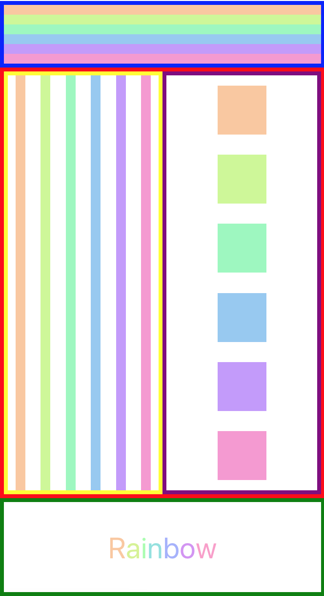

import ReactPlayer from 'react-player';

# Labo 2

Voor dit labo moet je de volgende theorie bekeken hebben:
- Flexbox
- Custom Components

## Opdracht: Rainbows

Maak een nieuw project `Rainbows` aan met expo. Vervang de inhoud van `App.tsx` door de volgende code:

```typescript expo={"dependencies": "rainbow-colors-array-ts"}
import * as React from "react";
import { rainbow } from "rainbow-colors-array-ts";
import {View, StyleSheet} from "react-native";
import Constants from 'expo-constants';

export default function App() {

  return (
    <View style={styles.container}>
       
    </View>
  );
}

const styles = StyleSheet.create({
  container: {
    flex: 1,
    justifyContent: "flex-start",
    paddingTop: Constants.statusBarHeight,
  }
});
```

In dit labo gaan jullie spelen met Flexbox en Custom components. Ipv stapsgewijs de oefening op te bouwen, starten we deze keer met een screenshot. Het is de bedoeling dat jullie een React Native app maken die er exact hetzelfde uitziet:


We geven jullie hieronder enkele vereisten en tips:
### Vereisten:
- Zorg dat elke regenboog voorgesteld wordt door 1 custom component Rainbow
- Gebruik een custom component Footer voor de tekst Rainbow
- Gebruik een custom component  Letter voor elke letter van de tekst Rainbow
- Plaats alle custom components in hun eigen bestand
- Gebruik de npm library `rainbow-colors-array-ts`. Gebruik hier de functie als volgt: rainbow(10, "hex",true); (lees de info op de npm pagina hoe je die gebruikt)
### Tips:
- Geef de style van de de Rainbow component mee als property
- Het typescript type van deze property is: `StyleProp<ViewStyle>`
- Geef de array van  kleuren van elk child element van Rainbow (dus elke "blokje" kleur) mee als property
- Geef de hoogte en breedte van elke child element van Rainbow mee als property (indien je niets meegeeft, zal de style van een element dit negeren)
- De eerste Rainbow heeft elementen van hoogte 10
- De tweede Rainbow heeft elementen van breedte 10
- De derde Rainbow heeft elementen van hoogte 50 en breedte 50
- De footer heeft een hoogte van 100
- de lettergrootte van de tekst Rainbow is 30
- Footer gebruik 7 maal de Letter component
- De tweede en derde Rainbow zitten samen in 1 View

Hier een screenshot met borders aan om een beter idee te krijgen van de layout:



### Oplossingsvideo

<ReactPlayer controls url='https://youtu.be/fOlEBWu9_8o'/>