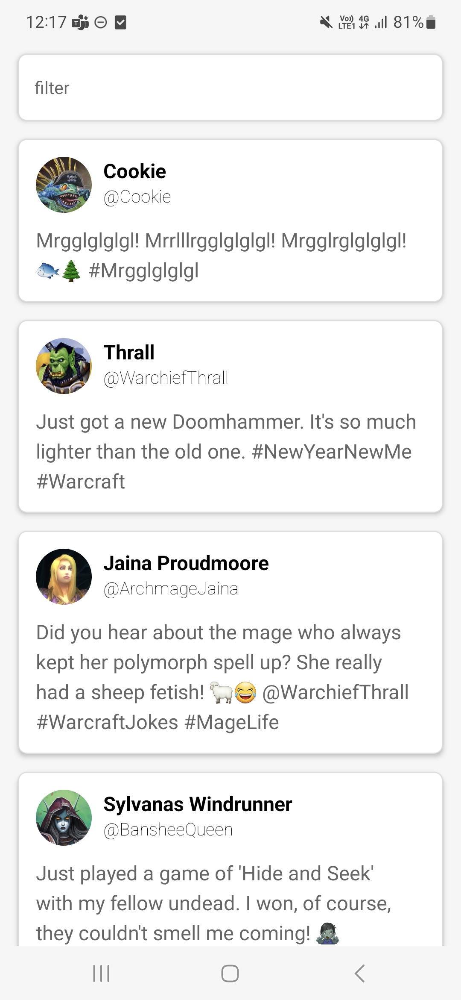

import ReactPlayer from 'react-player';

# Labo 3

Voor dit labo moet je de volgende theorie bekeken hebben:
- Lijsten
- Controlled components

## Opdracht: Twitter

Maak een nieuwe react native app. 

Zorg dat bij het opstarten van de app twee API calls gebeuren:
- Ophalen van de tweets: https://my-json-server.typicode.com/similonap/twitter-json-server/tweets
- Ophalen van de profielen: https://my-json-server.typicode.com/similonap/twitter-json-server/profiles

Je kan dit in een DataProvider component doen en werken met een context.

Vervolgens zorg je dat de tweets in een lijst getoond worden. De lijst moet er als volgt uitzien:

Zorg er ook voor dat je een filter input veld hebt waarmee je de tweets kan filteren op basis van de naam van de auteur. De filter moet case insensitive zijn.

Voorzie een swipe down to refresh functionaliteit.

### Oplossingsvideo

<ReactPlayer controls url='https://youtu.be/inSMqbQUz40'/>

## Opdracht: Dark/Light Toggle

Maak een nieuwe react native app. Plaats twee invoervelden in de app en een switch. ALs je op de switch duwt, veranderd de achtergrond kleur van de app initieel van wit naar zwart en omgekeerd. De invoervelden dienen om de kleur waartussen je kan switchen in te geven. De applicatie moet er als volgt uitzien:

## Opdracht: Rainbows met state

### Stap 1: Loops
Zorg dat je colors array 10 waarden bevat. Pas dan jouw Rainbow component aan zodat die over de eerste 6 waarden van de kleuren array loopt. (tip: je vervangt 6 lijnen code door 1 lijn)

Doe dit ook voor de Footer component: maak een variabele text aan die het woord Rainbow bevat en loop over de letters van het woord (tip: je vervangt 7 lijnen code door 1 lijn). 

Zorg dat het woord dat in Footer getoond wordt **nooit langer kan zijn dan 10 letters** (bv: als je de variabele text de waarde "Hallo ik ben een student van AP" geeft, zie je in de footer alleen "Hallo ik b")

### Stap 2: State

- Voeg een knop toe waarmee je de kleuren van de regenboog kan veranderen van pastel kleuren naar niet pastelkleuren (en omgekeerd)
- Voeg een input veld toe waar je een tekst kan ingeven. Als je op submit drukt, wordt de tekst in de footer veranderd naar de tekst die je ingegeven hebt. (tip: gebruik de `onSubmitEditing` event handler van een `TextInput` component)
- Je hebt hier twee state variabelen nodig.

Je kan je baseren op de volgende screen recording:

### Stap 3: Randomize rainbow

- Voeg nog een extra knop toe waarmee je de kleuren van de regenboog kan randomizen. (tip: gebruik de `Math.random()` functie)
- De tekst in de footer mag niet mee gerandomized worden.
- De pastel knop moet ook nog steeds werken.

### Oplossingsvideo

<ReactPlayer controls url='https://youtu.be/3EfjoCul3TE'/>