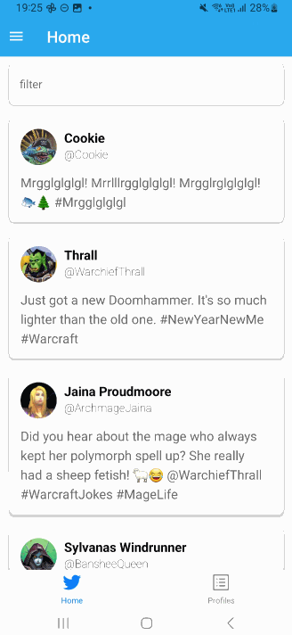
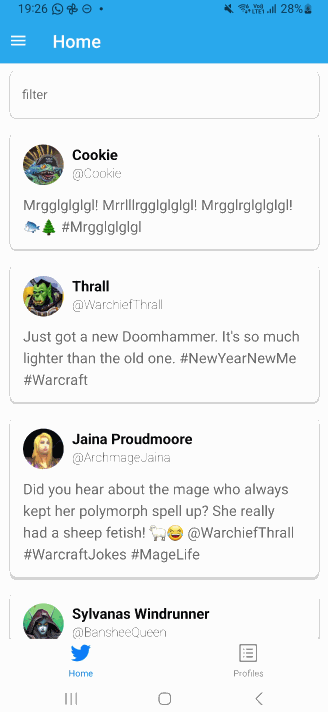
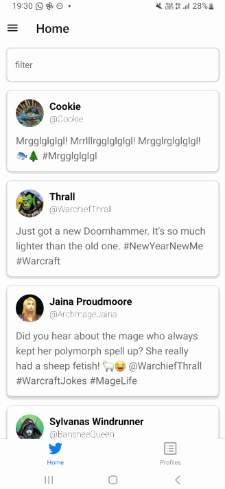
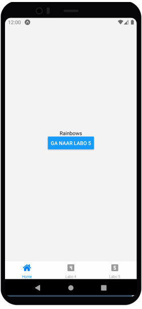

import ReactPlayer from 'react-player';

# Labo 4

Voor dit labo moet je de volgende theorie bekeken hebben:
- Routing en navigatie

## Opdracht: Twitter

Breidt de Twitter applicatie uit met expo router. De applicatie moet een Stack navigator combineren met een Tab navigator en een Drawer navigator.

De applicatie moet de volgende schermen bevatten:
- Home: Een scherm met een lijst van tweets (vorige opgave)
- Profiles: Een scherm met een lijst van alle profielen.

Deze schermen moeten bereikbaar zijn via een tab navigator.

Als je op een profiel drukt, moet je naar een nieuw scherm gaan met de details van het profiel. Dit scherm moet bereikbaar zijn via een stack navigator (dus niet meer via de tab navigator). Het scherm zal dus boven de tab navigator komen.

Vervolgens heb je ook een drawer navigator nodig. Deze moet bereikbaar zijn via een hamburger menu in de header van het home scherm. De drawer moet momenteel enkel een settings scherm en het home scherm bevatten. De inhoud zullen we later nog uitbreiden.

### Oplossingsvideo

<ReactPlayer controls url='https://youtu.be/uRG9HQudyhI'/>
<ReactPlayer controls url='https://youtu.be/BizAB01eoTs'/>

## Opdracht: Rainbow Navigation

Ga verder met de code van labo 4 en kopieer deze naar een nieuw project.

We bouwen de volgende applicatie:

De applicatie bestaat uit drie schermen:
- Een simpel "Home" scherm met een knop die naar scherm 3 gaat
- Een scherm dat de oefening van vorige week bevat
- Een scherm met een lijst van 200 kleuren verkregen via `rainbow-colors-array-ts`

Wanneer je op een kleur drukt, krijg je een detail scherm. Dit scherm heeft als achtergrondkleur de geselecteerde kleur en toont de hex waarde in de titel en in het midden van het scherm

#### Tips:
- Gebruik const colors = rainbow(200,"hex",true); voor de 200 kleuren die je toont op het 3e scherm.
- Je hebt een custom component nodig voor de inhoud van het labo van vorige week.
- Je hebt hier een combinatie van Stack en Tab navigatie nodig.

### Oplossingsvideo

<ReactPlayer controls url='https://youtu.be/TndQZTkZ9DM'/>
<ReactPlayer controls url='https://youtu.be/k4qtrqS7u54'/>