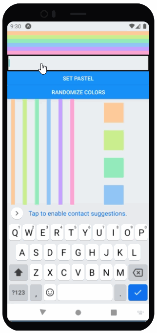

# Labo 4

Voor dit labo moet je de volgende theorie bekeken hebben:
- Lijsten
- Controlled components

## Opdracht: Rainbows met state

### Stap 1: Loops
Zorg dat je colors array 10 waarden bevat. Pas dan jouw Rainbow component aan zodat die over de eerste 6 waarden van de kleuren array loopt. (tip: je vervangt 6 lijnen code door 1 lijn)

Doe dit ook voor de Footer component: maak een variabele text aan die het woord Rainbow bevat en loop over de letters van het woord (tip: je vervangt 7 lijnen code door 1 lijn). 

Zorg dat het woord dat in Footer getoond wordt **nooit langer kan zijn dan 10 letters** (bv: als je de variabele text de waarde "Hallo ik ben een student van AP" geeft, zie je in de footer alleen "Hallo ik b")

### Stap 2: State

- Voeg een knop toe waarmee je de kleuren van de regenboog kan veranderen van pastel kleuren naar niet pastelkleuren (en omgekeerd)
- Voeg een input veld toe waar je een tekst kan ingeven. Als je op submit drukt, wordt de tekst in de footer veranderd naar de tekst die je ingegeven hebt. (tip: gebruik de `onSubmitEditing` event handler van een `TextInput` component)
- Je hebt hier twee state variabelen nodig.

Je kan je baseren op de volgende screen recording:

# Stap 3: Randomize rainbow

- Voeg nog een extra knop toe waarmee je de kleuren van de regenboog kan randomizen. (tip: gebruik de `Math.random()` functie)
- De tekst in de footer mag niet mee gerandomized worden.
- De pastel knop moet ook nog steeds werken.

