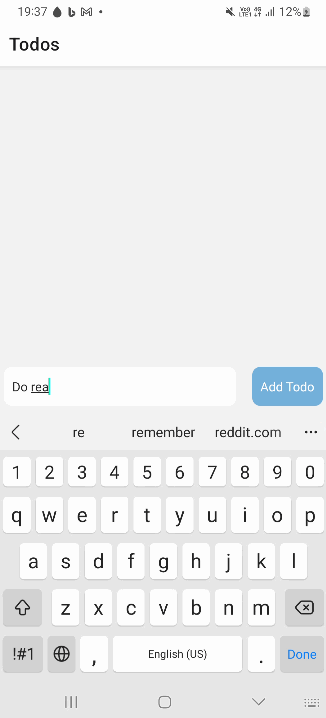

# Labo 5

Voor dit labo moet je de volgende theorie bekeken hebben:
- AsyncStorage

## Opdracht: Rainbow AsyncStorage

Ga verder met de code van labo 5. Breidt de applicatie uit met de volgende functionaliteit:
- Als de gebruiker de tekst veranderd in het tekstveld, wordt deze opgeslagen in AsyncStorage.
- Als de gebruiker veranderd tussen pastel en niet pastel kleuren, wordt dit opgeslagen in AsyncStorage.
- Als de gebruiker de applicatie opnieuw opstart, zal de laatst gekozen tekst getoond worden en de laatst gekozen kleuren.

## Opdracht: Todo App

Maak een eenvoudige Todo App. De gebruiker moet een todo kunnen toevoegen aan een lijst aan de hand van een text input en een button onderaan het scherm. Als de gebruiker op de todo klikt wordt deze gemarkeerd als "done" en wordt de todo doorgestreept. Er wordt onder de todo bijgehouden op welke dag en uur de todo werd voltooid. Als de gebruiker een todo lang ingedrukt houdt, wordt deze verwijderd uit de lijst.

De todo's worden opgeslagen in AsyncStorage. Als de gebruiker de applicatie opnieuw opstart, worden de todo's opnieuw getoond.

De werking kan je hieronder zien:

