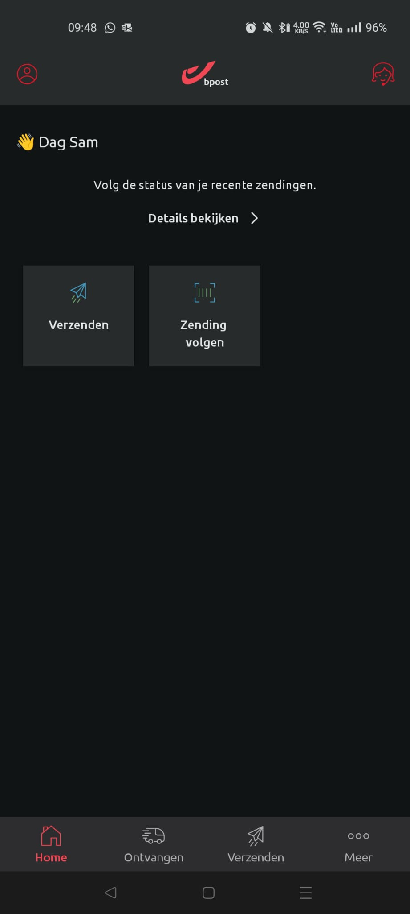
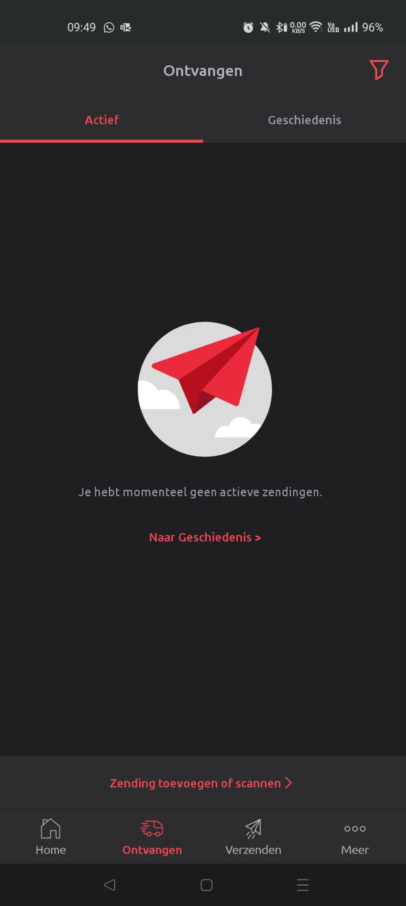
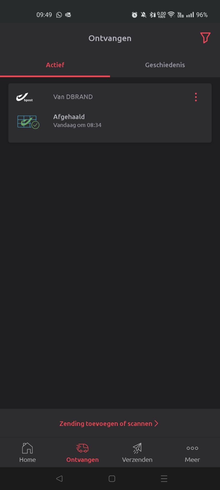
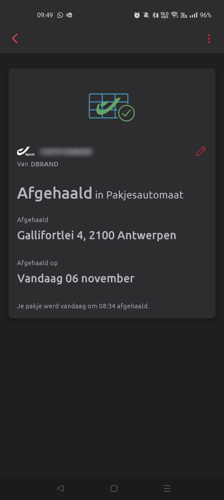
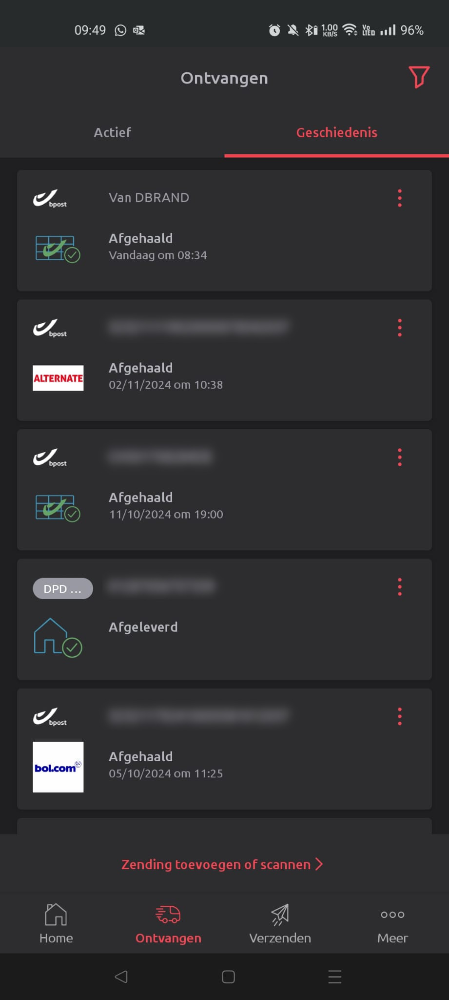
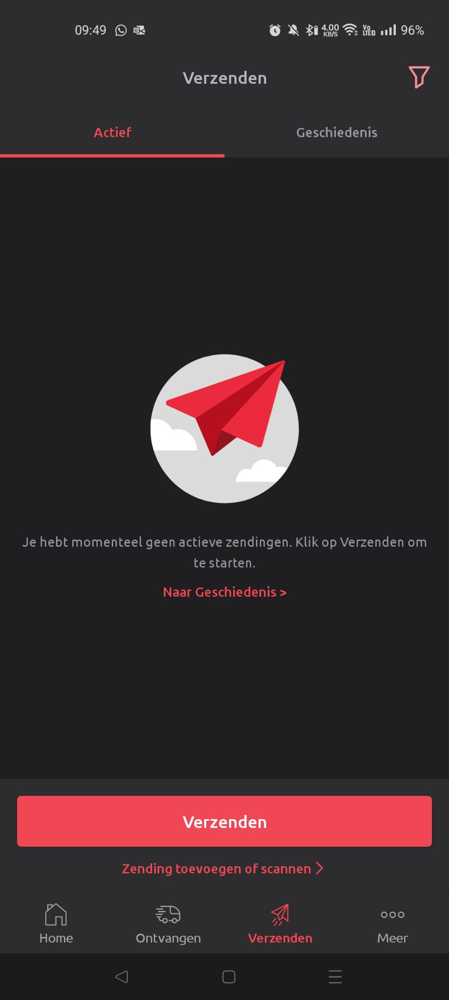
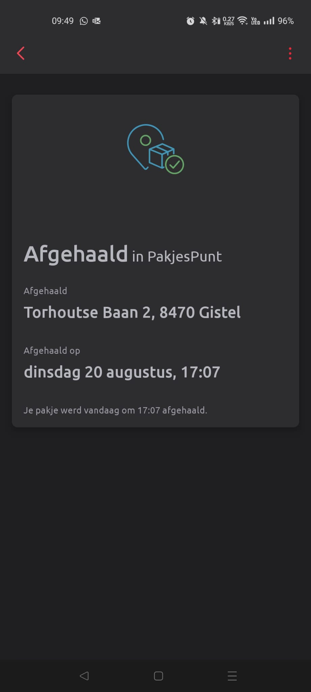
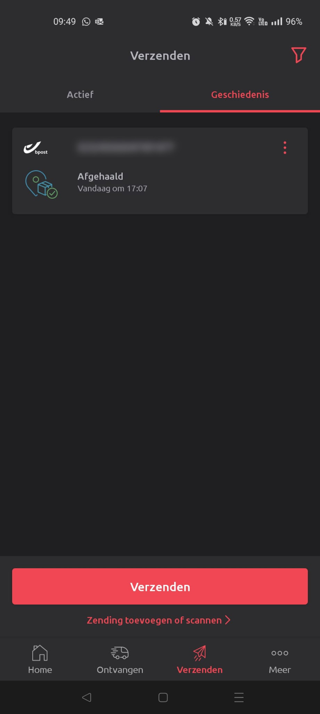
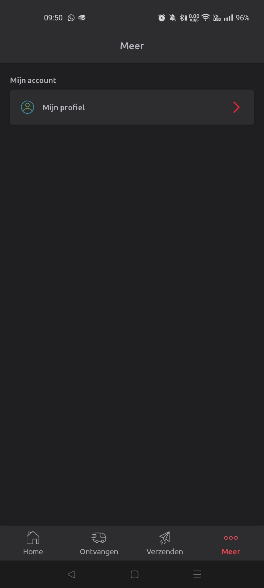
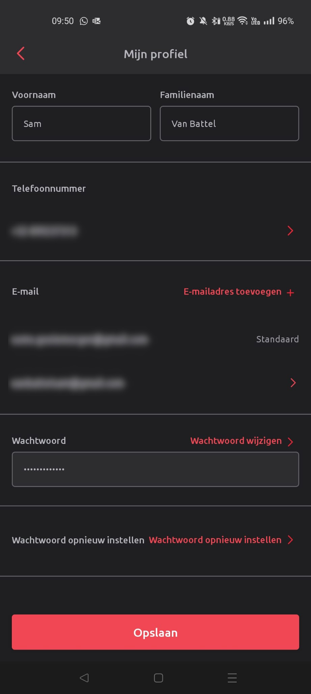

# Labo 6

## Herhalingsopdracht: BPost app

Maak de volgende app zo goed mogelijk na. De afbeeldingen tonen de verschillende schermen in de app. In de beschrijving onder elk scherm kan je de verschillende functies terugvinden van elk scherm.

Gebruik de volgende APIs om de data in te vullen en aan te passen:
- https://sampleapis.assimilate.be/bpost/verzenden
- https://sampleapis.assimilate.be/bpost/ontvangen
- https://sampleapis.assimilate.be/bpost/profile

**!LET OP!** Knoppen die niet staan opgelijst in de functies hieronder, moet je niet implementeren of weergeven.  
Bv.: de rode icoontjes (3 puntjes, bewerk-icoontje, ...)

### Home

functies:
- knoppen in het midden
  - Details bekijken: "ontvangen - actief" scherm
  - verzenden: brengt je rechtstreeks naar het "Verzenden - zending" scherm
  - Zending volgen: brengt je rechtstreeks naar het "Ontvangen - zending volgen" scherm
- menu (onderaan)
  - home: dit scherm
  - ontvangen: "ontvangen - actief" scherm
  - verzenden: "verzenden - actief" scherm
  - meer: "meer" scherm

### Ontvangen - actief

functies:
- knoppen in het midden
  - Bij leeg scherm: 
    - Naar Geschiedenis: "ontvangen - geschiedenis" scherm
  - Bij actieve zendingen:
    - Lijst met actieve zendingen. Elke zending brengt je naar het "Ontvangen - detail" scherm

 

### Ontvangen - detail

functies:
- terug knop bovenaan: brengt je terug naar het vorige scherm

### Ontvangen - geschiedenis

functies:
- knoppen in het midden
  - Lijst met afgelopen/ontvangen zendingen. Elke zending brengt je naar het "Ontvangen - detail" scherm

### Verzenden - actief

functies:
- knoppen in het midden
  - Bij leeg scherm: 
    - Naar Geschiedenis: "verzenden - geschiedenis" scherm
  - Bij actieve zendingen:
    - Lijst met actieve zendingen. Elke zending brengt je naar het "verzenden - detail" scherm

### Verzenden - detail

functies:
- terug knop bovenaan: brengt je terug naar het vorige scherm
- 

### Verzenden - geschiedenis

functies:
- knoppen in het midden
  - Lijst met afgelopen/ontvangen verzonden pakketjes. Elke zending brengt je naar het "Verzenden - detail" scherm

### Meer

functies:
- knoppen in het midden
  - Knop naar profiel pagina

### Meer - Profiel

formulier met account data

