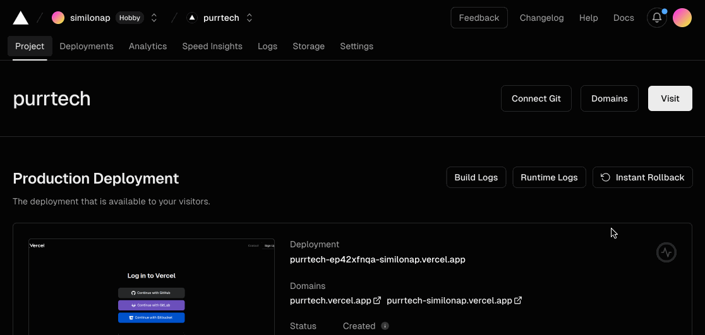

# Vercel

## Wat is Vercel?

Vercel is een cloudplatform voor het hosten van websites en webapplicaties. Het is ontworpen om de ontwikkeling en implementatie van webprojecten te vereenvoudigen, vooral die gebouwd met moderne frameworks en technologieën zoals Next.js, React, Angular en Vue.js.

Vercel staat ook bekend om zijn hoge prestaties. Het biedt snelle laadtijden door gebruik te maken van wereldwijde CDN (Content Delivery Network) en slimme caching, wat essentieel is voor het bieden van een goede gebruikerservaring en SEO.

Omdat Next.js is ontwikkeld door hetzelfde team achter Vercel, is de integratie tussen beide bijzonder soepel en efficiënt. 

## Hoe deploy ik een Next.js applicatie op Vercel?

### Stap 1: Maak een Vercel account aan

Ga naar [https://vercel.com/signup](https://vercel.com/signup) en maak een account aan. Je kan je Github account gebruiken om in te loggen.

### Stap 2: Installeer de Vercel CLI

De Vercel CLI is een command line tool die je kan gebruiken om je applicatie te deployen. Je kan deze installeren met npm:

```bash
npm install -g vercel
```

### Stap 3: Deploy je applicatie

Om je applicatie te deployen, moet je eerst inloggen met de Vercel CLI. Dit kan je doen met het volgende commando:

```bash
vercel login
```

Je kan vervolgens kiezen hoe je wil inloggen. Je kan inloggen met je Github account of met je email adres.

```bash
Vercel CLI 32.5.5
? Log in to Vercel 
● Continue with GitHub 
○ Continue with GitLab 
○ Continue with Bitbucket 
○ Continue with Email 
○ Continue with SAML Single Sign-On
```

Vervolgens moet je de link volgen die je krijgt om in te loggen en moet je de verificatie code gebruiken die je krijgt om in te loggen in de CLI.

```bash
> Please visit the following URL in your web browser:
> https://vercel.com/api/registration/login-with-github?mode=login&next=https%3A%2F%2Fvercel.com%2Fnotifications%2Fcli-login-oob

> After login is complete, enter the verification code printed in your browser.
? Verification code:
``` 

### Stap 4: Builden en deployen

Als je gebruik maakt van een lokaal gehoste CMS, moet je eerst je applicatie builden en kan je dit niet doen op vercel zelf. Dit moet dus lokaal gebeuren want Vercel heeft geen toegang tot je lokale machine. 

```bash
vercel build --prod
```

Je krijgt vervolgens een aantal vragen die je moet beantwoorden. Je kan de standaardwaarden gebruiken.

Als de build klaar is, kan je je applicatie deployen met het volgende commando:

```bash
vercel deploy --prebuilt --prod
```

Als dit gelukt is krijg je een link naar je applicatie. Je kan deze link gebruiken om je applicatie te bekijken.

### Stap 5: Publiek zetten van je applicatie

By default staan je applicaties op Vercel op privé. Je kan dit aanpassen in de settings van je applicatie in het onderdeel: "Deployment protection". Vervolgens zet je "Vercel Authentication" uit. Dan pas is je applicatie publiek toegankelijk.



