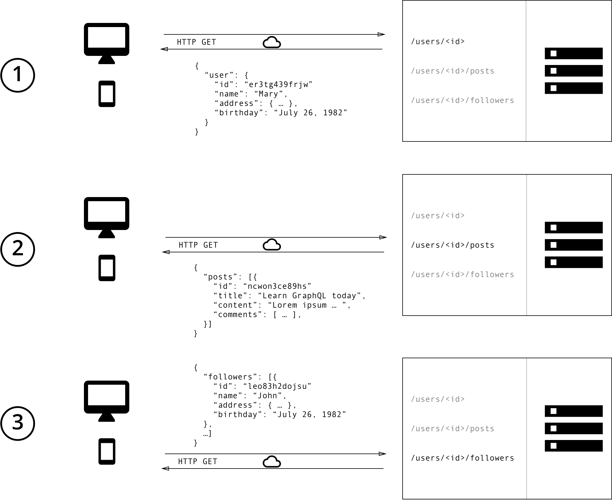
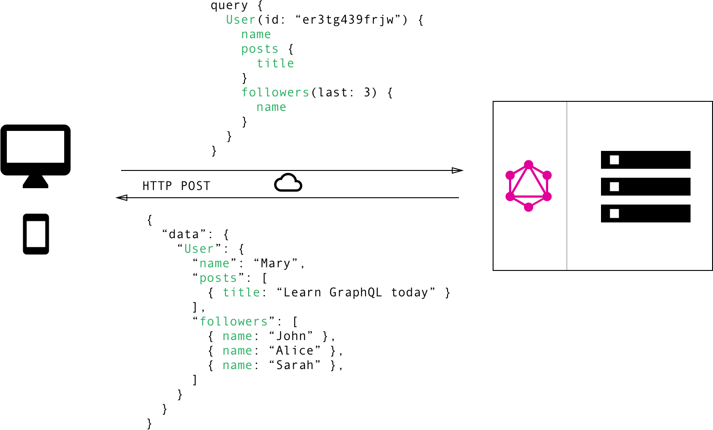
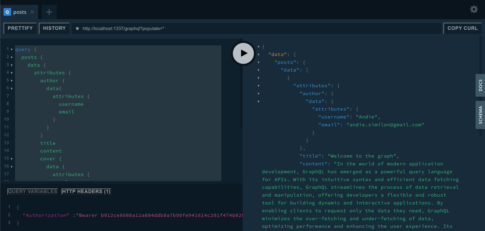

# GraphQL API 

GraphQL is een nieuwe API-standaard die een efficiënter, krachtiger en flexibeler alternatief biedt voor REST. Het is ontwikkeld en open source gemaakt door Facebook en wordt nu onderhouden door een grote gemeenschap van bedrijven en individuen van over de hele wereld.

Je kan een GraphQL-query zien als een GET-verzoek in REST. GraphQL-query's worden gebruikt om net zoals bij REST gegevens die de client nodig heeft op te vragen.

GraphQL maakt het **declaratief** ophalen van gegevens mogelijk, waarbij een client precies kan specificeren welke gegevens hij nodig heeft van een API. In plaats van meerdere endpoints die vaste datastructuren retourneren, stelt een GraphQL-server slechts één endpoint bloot en reageert met precies de data waar een gebruiker om vraagt.

:::info
Declaratief programmeren is een programmeer paradigma waarbij de programmeur bescrijft wat er moet gebeuren maar niet hoe het moet gebeuren. Dit is in tegenstelling tot imperatief programmeren waarbij de programmeur stap voor stap beschrijft hoe het programma moet werken. 
:::

GraphQL wordt vaak verward met een databasetechnologie. Dit is een misvatting, GraphQL is een zoektaal voor API's - niet voor databases. In die zin is het database-agnostisch en kan het effectief worden gebruikt in elke context waarin een API wordt gebruikt. M.a.w. je kan gegevens ophalen vanuit eender welke soort databasetechnologie MySQL, MongoDB, Redis, Neo4j, …

## Het verschil tussen REST en GraphQL

GraphQL is ontwikkeld met de behoefte aan meer flexibiliteit en efficiëntie te voldoen! Het lost veel van de tekortkomingen en inefficiënties op die ontwikkelaars ervaren bij interactie met REST API's.

De oplossing die Facebook bedacht is conceptueel heel eenvoudig: in plaats van meerdere endpoints te hebben, moet je een enkel endpoint hebben dat complexe requests kan verwerken en vervolgens alleen de gegevens terugstuurt dat de gebruiker nodig heeft. Er zal geen overhead zijn aan gegevens. M.a.w. het probleem van overfetching, waarmee de meeste REST API's kampen, wordt opgelost.

## Voorbeeld REST vs GraphQL

Om de belangrijkste verschillen tussen REST en GraphQL te illustreren, als het gaat om het ophalen van gegevens uit een API, laten we een eenvoudig voorbeeld bekijken:

in een blogtoepassing moet een app de titels van de berichten van een specifieke gebruiker weergeven. Hetzelfde scherm toont ook de namen van de laatste 3 volgers van die gebruiker. Hoe zou die situatie worden opgelost met REST en met GraphQL?

### REST

Met een REST API verzamel je de gegevens doorgaans door toegang te krijgen tot meerdere endpoints. In het voorbeeld zou dit een `/users/<id>` endpoint kunnen zijn om de initiële gebruikersgegevens op te halen. Ten tweede is er waarschijnlijk een `/users/<id>/posts/` endpoint dat alle posts voor een gebruiker retourneert. Het derde endpoint is de `/users/<id>/followers/` die een lijst met volgers per gebruiker retourneert.



Met REST moet je drie verzoeken doen aan verschillende endpoints om de vereiste gegevens op te halen. Je haalt ook te veel gegevens op omdat de endpoints aanvullende informatie retourneren die niet we in de front-end niet zullen gebruiken. M.a.w. er wordt aan **overfetching** gedaan!

### GraphQL

In GraphQL daarentegen, stuur je één enkele query naar de GraphQL-server waarin je concreet vermeld welke data je nodig hebt. De server reageert vervolgens met een JSON-object dat alleen de gevraagde data bevat.



aan de hand van een query kan de gebruiker in GraphQL precies de gegevens specificeren die hij/zij nodig heeft. In de bovenstaande foto wordt er een query geleverd aan de GraphQL-server met daarin de vraag achter specifieke informatie van de user. De client ontvangt vervolgens precies de informatie die hij/zij in de query heeft gedefinieerd en niets meer, waardoor overfetching gegevens wordt vermeden. Merk op dat de structuur van het antwoord van de server precies de geneste structuur volgt die in de query is gedefinieerd.
Daarbij wordt er maar één request naar de server gestuurd en wordt het probleem van underfetching vermeden.

## Voordelen van GraphQL

GraphQL zorgt ervoor dat de verschillende pijnpunten waarmee REST kampt worden opgelost. Met GraphQL vermijd je overfetching en underfetching door het gebruik van een voorgedefinieerd schema. Je moet maar één endpoint aanspreken, m.a.w. één request sturen naar de server, en je krijgt alleen de gevraagde data terug. Geen overhead van data en geen complexe kettingreacties van requests naar verschillende endpoints. Dit maakt het voor de front-end developer veel aangenamer en gemakkelijker om data vanuit de server op te vragen en te verwerken in de front-end.

GraphQL werkt met een voorgedefinieerd schema die de structuur van de opvraagbare data bevat. Dit maakt de API zeer eenvoudig te begrijpen en gemakkelijk te gebruiken. Je kan een schema in GraphQL zien als de documentatie waarmee de front-end developer te weten kan komen hoe hij/zij data kan opvragen van de server. M.a.w. er is nogmaals een vermindering van complexiteit voor de front-end developers!

- Duidelijke documentatie die out of the box wordt voorzien;
- Geen overhead van data in de responds van de server;
- Er moet maar één endpoint aangesproken worden m.a.w. één roundtrip naar de server en terug;

## Nadelen van GraphQL

Als GraphQL alleen maar voordelen heeft tegenover REST dan werd REST hoogstwaarschijnlijk al lang niet meer gebruikt. Het kiezen tussen een GraphQL of REST API hangt af van de use case waarin de API zal worden gebruikt.

**Serverside Complexiteit**

Een groot nadeel is dat alle complexiteit op de schouders van de back-end developers valt. Een GraphQL API maakt het gemakkelijk voor de front-end developers. Hoe data wordt opgevraagd, gewijzigd en verwijderd kan afgeleid worden uit het GraphQL schema.
De back-end developers daarin tegen moeten er voor zorgen dat de databank structuur in één overzichtelijk en gemakkelijk te gebruiken schema wordt gegoten. Hoe groter het project, hoe ingewikkelder dit wordt. Je centraliseert alles tot één geheel, één GraphQL schema. Als er zich ooit een fout optreedt dan is de kans groot dat heel de werking van de API wordt belemmerd.

**Stijle Leercurve**

Een ander nadeel is dat de werking van GraphQL heel anders is dan dat van REST. In GraphQL schrijf je queries waarmee je data kan opvragen en mutaties om data weg te schrijven. Buiten deze twee nieuwe termen moet de ontwikkelaar ook verschillende begrippen leren zoals query-argumenten, fragmenten, etc.Het kan even duren vooraleer nieuwe developers er mee weg zijn.

**POST requests**

Alle requests van GraphQL zijn POST requests. Zelfs als je data opvraagt zal GraphQL dit behandelen als een POST. Dit heeft als nadeel dat de browser niet automatisch de opgevraagde gegevens cached. Ook al is de data al eens vanuit de server opgevraagd toch zal GraphQL hiervoor een request naar de server sturen. Er zijn uiteraard verschillende libraries die dit probleem oplossen, maar dan ben je weer afhankelijk van een externe library, wat soms bij kleine projecten niet nodig is.

## GraphQL in Strapi

Strapi heeft by default een REST API die je kan gebruiken om data op te vragen. Je kan echter ook gebruik maken van GraphQL. Je kan deze activeren door de graphql plugin te installeren.

```bash
npm run strapi install graphql
```

Deze zal er voor zorgen dat er een nieuwe endpoint wordt aangemaakt op `/graphql`. Je kan deze endpoint gebruiken om GraphQL queries naar te sturen. Je kan daarna naar de url `http://localhost:1337/graphql` surfen om de GraphQL playground te openen. Hier kan je queries schrijven en uitvoeren. 



De query komt exact overeen met de velden die je wil zien in het resultaat.

```graphql
query {
  posts {
    data {
      attributes {
        author {
          data{
            attributes {
              username
              email
            }
          }
        }
      	title
        content
        cover {
          data {
            attributes {
              url
            }
          }
        }
      }
    }
  }
}

Merk op dat je hier ook de Authorization header moet toevoegen voordat je de query kan uitvoeren. Je moet de API token hier meegeven die je ook in de REST API gebruikt. Je kan deze vinden in de settings van de Strapi admin interface.
```

Je kan deze query ook uitvoeren aan de hand van een meegegeven id:

```graphql
query {
  post(id:1) {
    data {
      attributes {
      	title
        content
      }
    }
  }
}
```

### Client code (zonder externe libraries)

Je kan deze GraphQL API ook gebruiken in je eigen React applicatie. Je kan hiervoor gebruik maken van de `fetch` API. Je kan de query die je in de GraphQL playground hebt geschreven ook gebruiken in je client code. Dit kan je ook in je getStaticProps functie gebruiken om data op te halen.

```typescript
const response = await fetch(
    "http://localhost:1337/graphql",
    {
      method: "POST",
      body: JSON.stringify({
        query: `query {
          posts {
            data {
              attributes {
                author {
                  data {
                    attributes {
                      username
                      email
                    }
                  }
                }
                title
                content
                cover {
                  data {
                    attributes {
                      url
                    }
                  }
                }
              }
            }
          }
        }`,
      }),
      headers: {
        "Authorization": `Bearer ${process.env.TOKEN}`,
        "Content-Type": "application/json",
      },
    }
  )
  let json = await response.json();
  ```

### Client code (met externe libraries)

We gaan in dit voorbeeld gebruik maken van Apollo Client in samenwerking met code generation voor TypeScript types. Ja, je leest dit goed. Het genereren van types in TypeScript voor graphql kan volledig automatisch verlopen. 

Het eerste wat je moet doen is de code generation tools installeren:

```bash
npm i -S graphql
npm i -D typescript ts-node @graphql-codegen/cli @graphql-codegen/client-preset
```

In de root van je project (het niveau boven je src folder) plaats je een bestand genaamd `codegen.ts`. Hierin plaats je de volgende code:

```bash
import type { CodegenConfig } from '@graphql-codegen/cli'
 
const config: CodegenConfig = {
   schema: 'https://localhost:1337/graphql',
   documents: ['src/**/*.tsx'],
   generates: {
      './src/gql/': {
        preset: 'client',
      }
   }
}
export default config
```

De url in schema moet linken naar de GraphQL endpoint van je Strapi applicatie. De rest van de code kan je zo laten staan.

Als je nu in de root van je project het volgende commando uitvoert zal je zien dat er een nieuwe folder `gql` is ontstaan. Hier worden alle typescript types voor graphql gegenereerd.

```
yarn graphql-codegen
```

Je kan dit commando ook met de `--watch` flag uitvoeren zodat de types elke keer opnieuw worden gegenereerd gebaseerd op de graphql queries dat je schrijft. 

Vervolgens gaan we de apollo client library installeren zodat we nu een echte GraphQL client hebben die we kunnen gebruiken in onze applicatie.

```bash
npm install @apollo/client graphql
```

Maak vervolgens een bestand `apollo-client.ts` aan in je `src` folder met de volgende inhoud:

```
import { ApolloClient, HttpLink, InMemoryCache } from "@apollo/client";

const createApolloClient = () => {
  return new ApolloClient({
    link: new HttpLink({
      uri: 'http://localhost:1337/graphql',
      headers: {
        Authorization: `Bearer ${process.env.TOKEN}`
      }
    }),
    cache: new InMemoryCache(),
  });
};

export default createApolloClient;
```

Dit gaat er momenteel vanuit dat je strapi op localhost loopt en dat je de API token in een environment variabele hebt gestoken. Je kan dit ook hardcoden in de headers van de HttpLink.

Maak nu de query aan in het bestand waar je de data wil ophalen. In dit voorbeeld gaan we de data ophalen in de index.tsx van de pages folder.

```typescript
import { graphql } from "@/gql/index"

const GetAllPostsWithAuthors = graphql(`
query GetAllPostsWithAuthors {
  posts {
    data {
      attributes {
        author {
          data{
            attributes {
              username
              email
            }
          }
        }
        title
        content
        cover {
          data {
            attributes {
              url
            }
          }
        }
      }
    }
  }
}
`);
```

Vervolgens kan je deze query gebruiken in je getStaticProps functie:

```typescript
const client = createApolloClient();
const {data} = await client.query({query: GetAllPostsWithAuthors, variables: {}})
```

Als je nu data gebruikt zal je opmerken dat het automatisch het juiste type heeft en dat je autocompletion hebt. 