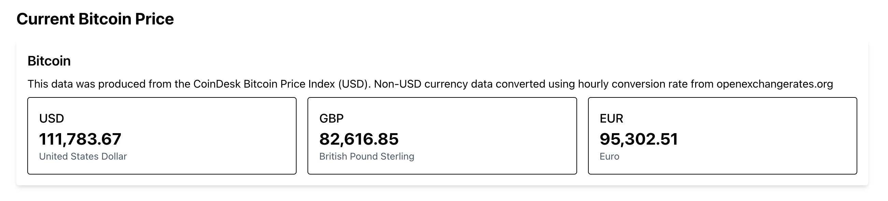

# Labo 1

Voor dit labo moet je de volgende theorie bekeken hebben:
- Server Components
- Client Components

## 1. Bitcoin Price

Maak een nieuwe Next.js applicatie aan en noem deze `bitcoin-next`. Je mag zelf kiezen of je tailwind css wil gebruiken of niet.

Gebruik de https://sampleapis.assimilate.be/bitcoin/current API om de huidige prijs van Bitcoin op te halen en te tonen in je applicatie. Je laat 3 blokken zien met de prijs informatie per currency (USD, EUR, GBP).

Zorg ervoor dat je gebruik maakt van de volgende componenten:
- CurrencyCard: toont de informatie van een enkele currency. 
- CurrencyList: toont een lijst van CurrencyCard componenten. Deze component haalt de data op van de API en geeft deze door aan de CurrencyCard componenten.

Denk zelf eens na of er hier nood is aan client components.

Om duidelijk te maken wat er mogelijk is met server components en wat niet moet je de volgende mogelijke uitdagingen proberen te implementeren. Doe dit enkel alleen maar op het moment dat je het vorig deel hebt gemaakt.
- Zorg ervoor als je op de currency klikt dat deze een andere background color krijgt. Denk opnieuw goe na over welke componenten client en welke server componenten zijn.
- Zorg ervoor dat de prijs van de bitcoin elke 10 seconden wordt uitgelezen. Kan je dan nog altijd server components gebruiken? 
- Probeer een server component te gebruiken voor het initieel inlezen van de bitcoin data. De data moet blijven updaten elke minuut.
