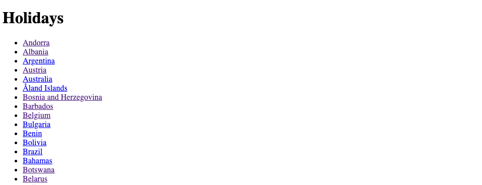
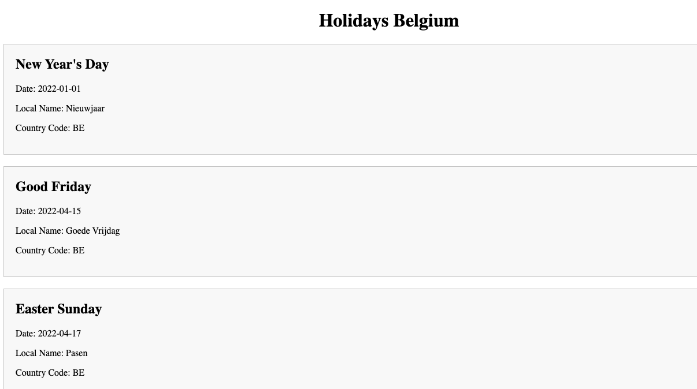

import Labo7Pokemon from '@site/src/components/LabSolutions/Pokemon/App';
import ReactPlayer from 'react-player';

# Labo 2

- Server side rendering
- Static site Generation

## 1. Animals 

Pas de animals oefening van vorige week aan zodat je gebruik maakt van server side rendering. Je mag de data uit een json bestand halen maar dit moet volledig server side gebeuren. Je mag dus geen fetch gebruiken in de browser.

## 2. SSG Animals

Pas de animals oefening nu aan zodat je gebruik maakt van static site generation. Elke pagina moet dus op voorhand gegenereerd worden. 

## 3. Pokemon app

Pas de pokemon app oefening van vorige week aan zodat je gebruik maakt van static site generation. Elke pagina moet op voorhand gegenereerd worden.

### Oplossingsvideo

<ReactPlayer controls url='https://youtu.be/eSIWPAkEIio'/>
<ReactPlayer controls url='https://youtu.be/8uvegPrBS9c'/>

## 4. Holiday calendar

Maak een nieuwe Next.js applicatie aan met de naam "holiday-calendar". We willen een pagina maken waar we alle feestdagen van een bepaald land kunnen opzoeken. We willen een volledige static generated site genereren.

Je moet gebruik maken van de volgende API: https://date.nager.at/swagger/index.html

Je moet de volgende pagina's voorzien:
- /holidays -> deze pagina moet een lijst tonen van alle landen waarvoor je feestdagen kan opvragen. 
- /holidays/[countrycode] -> deze pagina moet een lijst tonen van alle feestdagen voor het land met de gegeven countrycode.




Uitbreidingen:
Pas de paden aan zodat je de volgende urls krijgt:
- /holidays -> deze pagina moet een lijst tonen van alle landen waarvoor je feestdagen kan opvragen.
- /holidays/[countrycode] -> toont een aantal jaren waarvoor je feestdagen kan opvragen. Deze mag hardcoded zijn (bv: 2020, 2021, 2022)
- /holidays/[countrycode]/[year] -> deze pagina moet een lijst tonen van alle feestdagen voor het land met de gegeven countrycode en het gegeven jaar.

### Oplossingsvideo

<ReactPlayer controls url='https://youtu.be/zC7vvHwLhjY'/>

## 5. Priem getallen

Maak een nieuwe Next.js applicatie aan met de naam "prime-numbers". We willen een pagina maken die het zoeken naar priem getallen demonstreert. 

bv: 
- het 5de priem getal is 11 want 2, 3, 5, 7, 11 zijn de eerste 5 priem getallen.
- het 10de priem getal is 29 want 2, 3, 5, 7, 11, 13, 17, 19, 23, 29 zijn de eerste 10 priem getallen.
- het 100ste priem getal is 541 want 2, 3, 5, 7, 11, 13, 17, 19, 23, 29, ..., 523, 541 zijn de eerste 100 priem getallen.

Wij willen een pagina voorzien waar de eerste 4000 priem getallen op staan. Hiervoor kan je de volgende functie gebruiken: 

```ts
const nthprime = (n: number) => {
    let count = 0;
    let i = 1;
    while (count < n) {
        i++;
        if (isPrime(i)) {
            count++;
        }
    }
    return i;
}

const isPrime = (n: number) => {
    if (n < 2) {
        return false;
    }
    if (n == 2) {
        return true;
    }
    if (n % 2 == 0) {
        return false;
    }
    let maxDivisor = Math.sqrt(n);
    for (let i = 3; i <= maxDivisor; i += 2) {
        if (n % i == 0) {
            return false;
        }
    }
    return true;
}
```

Laat je niet afschrikken door de naam van deze oefening. Het is een oefening die je moet doen om te leren hoe je static site generation kan gebruiken. De wiskunde achter het genereren van de priem getallen is niet belangrijk en moet je niet begrijpen.

Voor het 100ste priem getal is dit dus:

```ts
nthprime(100) // 541
```

Wil je een array van de eerste 100 priem getallen dan kan je dit doen:

```ts
const primes = [];
for (let i = 1; i <= 100; i++) {
    primes.push(nthprime(i));
}
```

Maak de volgende pagina's aan:
- prime-spa -> deze pagina moet de eerste 4000 priem getallen tonen op basis van client side rendering. 
- prime-ssr -> deze pagina moet de eerste 4000 priem getallen tonen op basis van server side rendering.
- prime-ssg -> deze pagina moet de eerste 4000 priem getallen tonen op basis van static site generation.

Je moet deze oefening niet in dev mode uitvoeren want static site generation werkt niet in dev mode. Je kan de applicatie dus gewoon builden en runnen.

```
npm run build
npm run start
```

De pagina zal er als volgt uitzien: 


Vergelijk de verschillende pagina's met elkaar. Wat is het verschil in laadtijd? Wat is het verschil in grootte van de pagina? Wat is het verschil in de netwerk tab? 

### Oplossingsvideo

<ReactPlayer controls url='https://youtu.be/CDB9M6O8_ug'/>

