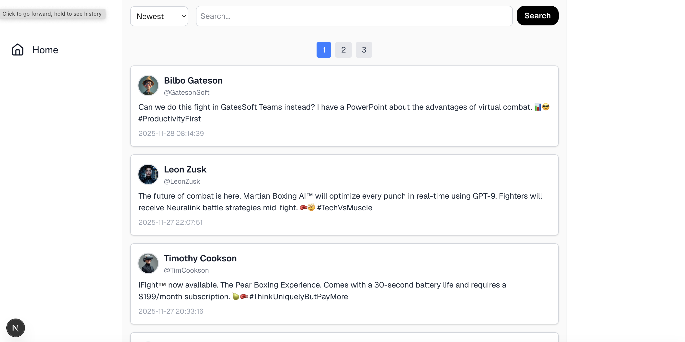
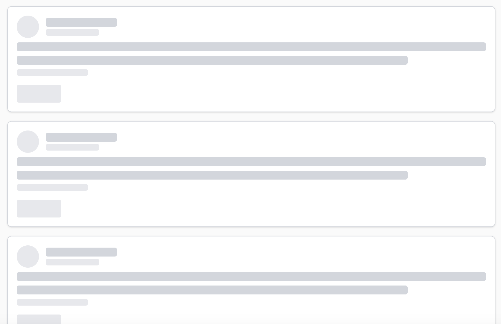

# Labo 2

Voor dit labo moet je de volgende theorie bekeken hebben:
- Routing

## 1. Search/Sorting/Paging

> 📂 **Naam project:** `lab-nextjs-query`
> 🔗 **Basis project:** n/a

In dit labo ga je een Next.js applicatie maken die gebruik maakt van query parameters in de URL om zoekopdrachten, sortering en paginatie te implementeren.

Gebruik de [SampleAPIs Harry Potter Spells API](https://sampleapis.assimilate.be/harrypotter/spells) om de data van de spreuken op te halen in een server component.

Gebruik de volgende interface om de data van de spreuken te typen:

```typescript
export interface Spell {
    id: number;
    name: string;
    type: string;
    mana: number;
    description: string;
    difficulty: "Beginner" | "Intermediate" | "Advanced" | "Expert";
    effectDuration: string;
    isUnforgivable: boolean;
    range: string;
    counterSpell: string;
    alignment: "Good" | "Neutral" | "Dark";
}

export type SortField = "name" | "difficulty" | "type" | "id";
export type SortDirection = "asc" | "desc";
```

Voorzie drie verschillende routes in de applicatie:
- `/`: de home pagina met links naar de andere drie pagina's.
- `/search`: een pagina waar de gebruiker kan zoeken naar spreuken op naam. De zoekterm moet worden weergegeven in de URL als query parameter `q`.
- `/sorting`: een pagina waar de gebruiker de spreuken kan sorteren op naam, difficulty, type of id. De sorteer veld en richting moeten worden weergegeven in de URL als query parameters `sortField` en `sortDirection`.
- `/paging`: een pagina waar de gebruiker door de spreuken kan bladeren met paginatie. De huidige pagina moet worden weergegeven in de URL als query parameter `page`.
- `all`: een pagina waar de gebruiker alle functionaliteiten (zoeken, sorteren en pagineren) kan gebruiken. De zoekterm, sorteer veld, sorteer richting en huidige pagina moeten worden weergegeven in de URL als query parameters `q`, `sortField`, `sortDirection` en `page`.

## 2. Y-Clone (Routing) (twitter)

> 📂 **Naam project:** `lab-nextjs-y-routing`  
> 🔗 **Basis project:** [`lab-nextjs-y-basic`](../lab1/README.md#lab-nextjs-y-basic)

We bouwen verder op de Y-Clone applicatie die je in het vorige labo hebt gemaakt. Deze keer gaan we routing toevoegen aan de applicatie.

Pas de applicatie aan zodat je de data van de posts en de profielen uit een MongoDB database haalt. Maak hiervoor gebruik van de `mongodb` npm package. Je kan de database lokaal draaien of gebruik maken van een cloud oplossing zoals MongoDB Atlas.

### De database seed route

Voorzie een pagina op de route `/admin/seed` die de database seedt met de posts en profielen data. Je kan hiervoor de fetch calls hergebruiken die je in het vorige labo hebt gebruikt om de data op te halen. Vervolgens sla je deze data op in de database.

Je kan de volgende `database.ts` file gebruiken om de database connectie en de seed functie te implementeren:

```typescript
import { Collection, MongoClient, Sort } from "mongodb";
import { Post, Profile } from "@/types";

const client = new MongoClient(process.env.MONGODB_URI || "mongodb://localhost:27017");

export const postsCollection: Collection<Post> = client.db("y-clone").collection<Post>("post");
export const profilesCollection: Collection<Profile> = client.db("y-clone").collection<Profile>("profiles");

const PAGE_SIZE = 5;

export const seedDatabase = async () => {
    await postsCollection.deleteMany({});
    await profilesCollection.deleteMany({});

    const response = await fetch("https://raw.githubusercontent.com/similonap/json/refs/heads/master/y-clone/profiles.json");
    if (!response.ok) {
        throw new Error("Fetching profiles went wrong")
    }
    const profiles = await response.json() as Profile[];

    await profilesCollection.insertMany(profiles);

    const responsePosts = await fetch("https://raw.githubusercontent.com/similonap/json/refs/heads/master/y-clone/posts.json");
    if (!responsePosts.ok) {
        throw new Error("Fetching posts went wrong")
    }
    let posts = await responsePosts.json() as Post[];

    posts = posts.map(post => ({ ...post, likes: Math.floor(Math.random() * 100) }));

    await postsCollection.insertMany(posts);

    const postsFromDb = await postsCollection.find().toArray();
    console.log("Seeded posts:", postsFromDb);
    const profilesFromDb = await profilesCollection.find().toArray();
    console.log("Seeded profiles:", profilesFromDb);

    return { posts: postsFromDb, profiles: profilesFromDb };
}

export const getProfileByUsername = async (username: string) => {
    const profile = await profilesCollection.findOne({ username: username });

    if (!profile) {
        throw new Error("Profile not found");
    }

    return profile;
}

export const getPostsByUsername = async (username: string, sort: string = "newest", page: number = 1) => {
    let sortObject: Sort = { createdOn: -1 }; 
    if (sort === "oldest") {
        sortObject = { createdOn: 1 };
    } else if (sort === "most_liked") {
        sortObject = { likes: -1 };
    }

    let posts = await postsCollection.find({ username: username }).sort(sortObject).skip((page - 1) * PAGE_SIZE).limit(PAGE_SIZE).toArray();
    const profile = await getProfileByUsername(username);

    posts = posts.map(post => {
        return {
            ...post,
            profile: profile
        } as Post;
    });

    const totalPosts = await postsCollection.countDocuments({ username: username });
    const pages = Math.ceil(totalPosts / PAGE_SIZE);

    return { posts, pages };
}

export const getPosts = async (q: string = "", sort: string = "newest", page: number = 1) => {
    let sortObject: Sort = { createdOn: -1 };
    if (sort === "oldest") {
        sortObject = { createdOn: 1 };
    } else if (sort === "most_liked") {
        sortObject = { likes: -1 };
    }


    let posts = await postsCollection.find({ text: new RegExp(q, "i") }).sort(sortObject).skip((page - 1) * PAGE_SIZE).limit(PAGE_SIZE).toArray();
    let profiles = await profilesCollection.find().toArray();

    posts = posts.map(post => {
        return {
            ...post,
            profile: profiles.find(p => p.username === post.username)
        } as Post;
    });

    const totalPosts = await postsCollection.countDocuments({ text: new RegExp(q, "i") });
    const pages = Math.ceil(totalPosts / PAGE_SIZE);


    return { posts, pages };
}
```

Als de pagina bezocht wordt zal deze pagina de database seeden met de posts en profielen data en een bericht tonen dat de seed succesvol is uitgevoerd.

```
Seeded 11 posts and 6 profiles.
```

### Navigatie menu

Voorzie een navigatie menu die op elke pagina zichtbaar is. Voeg hiervoor een `MenuBar` component toe die gebruik maakt van de `Link` component van Next.js om te navigeren tussen de verschillende pagina's. 



### Home pagina met paginatie en sortering

Pas de home pagina (`/`) aan zodat deze de posts ophaalt uit de database in plaats van uit de API. Voeg paginatie toe zodat er telkens 5 posts per pagina getoond worden. Voeg ook sortering toe zodat de gebruiker kan kiezen om de posts te sorteren op "newest", "oldest" of "most liked". Er moet ook een zoekbalk voorzien worden zodat de gebruiker kan zoeken op tekst in de posts. Telksens de sortering, paginatie of zoekterm verandert moet dit worden weergegeven in de huidige URL als query parameters.

Bij het laden van de posts moet er een laadskelet getoond worden.




### Profiel pagina

Voorzie een profiel pagina op de route `/[username]` waar `[username]` de gebruikersnaam is van het profiel dat bekeken wordt. Op deze pagina worden alle posts van de gebruiker getoond met paginatie. Hier hoeft geen zoekbalk of sortering voorzien te worden.


