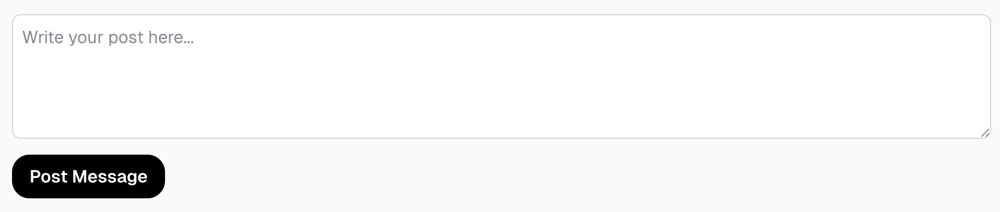

# Labo 2

Voor dit labo moet je de volgende theorie bekeken hebben:
- Form Handling

## 2. Y-Clone (Forms) (twitter)

> 📂 **Naam project:** `lab-nextjs-y-routing`  
> 🔗 **Basis project:** [`lab-nextjs-y-routing`](../lab2/README.md#lab-nextjs-y-routing)

In deze oefening moet je het vorige project uitbreiden met een formulier waarmee een gebruiker een nieuwe post kan aanmaken. Er moet nog geen user authenticatie zijn, dus je kan de post aanmaken onder de naam `JonDoe`.

