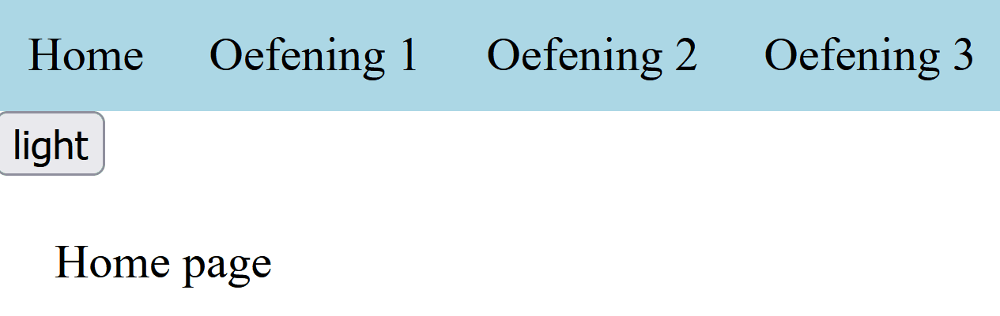
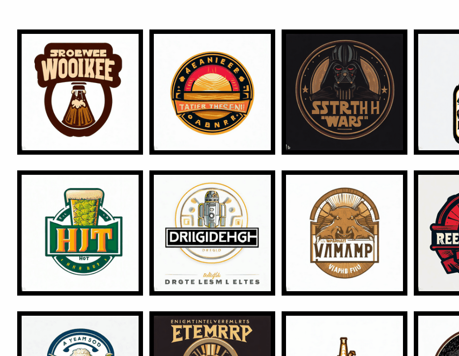
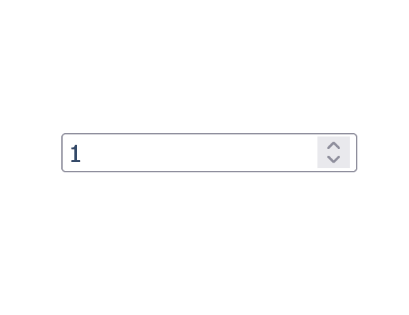
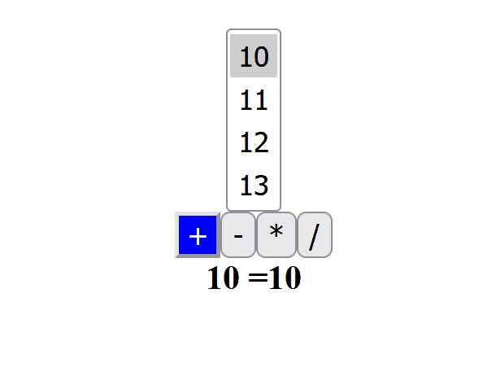

# Extra Oefeningen

## Tussentijdse toets 2023-2024

<details>
<summary><strong>Routing en Context</strong> ( /5)</summary>

> - [ ] Maak 3 componenten aan:
>   - `Home`
>   - `Oefening1`
>   - `Oefening2`
>   - `Oefening3`
> - [ ] Plaats elke component in z'n eigen `.tsx` bestand
> - [ ] Gebruik client-side routing met het `react-router` package.  
    In `App.tsx` gebruik je routing om elke component als een aparte pagina te gebruiken.
>   - `Home` is de startpagina (root route)
>   - `Oefening1`, `Oefening2`, `Oefening3` krijgen elk een aparte route
> - [ ] Voorzie een `Root` component die de gemeenschappelijke delen voor elke pagina bevat.
> - [ ] Elke pagina heeft een header, met daarin een menu
>   - De menu bevat een link naar elke pagina
>   - Gebruik het `navLink` element uit `react-router-dom` voor de links naar de verschillende pagina's.
> - [ ] De `Root` component maakt gebruik van een `context` om te wisselen tussen een `light`-theme en een `dark`-theme. 
>   - De header bevat een knop om te wisselen tussen de verschillende themes.
> - [ ] De inhoud van de verschillende pagina's wordt getoond in een `main` element.
> - [ ] De `Home` component toont de woorden "Home page" op het scherm. De kleuren zijn afhankelijk van het `theme` uit de `theme`-context.
> 
> ```text
> root
> ├── header
> │   ├── nav
> │   │   ├── link to oefening1
> │   │   ├── link to oefening2
> │   │   └── link to oefening3
> │   │
> │   └── button to switch between light and dark theme
> │
> └── main
>     └── specific page content
> ```
>
> 

</details>

---

<details>
<summary><strong>Oefening 1: State, Arrays en Hooks</strong> ( /5)</summary>

> Werk verder in `oefening1.tsx` (dat je aanmaakte in de eerste opdracht)
>
> In deze opdracht ga je een lijst van bieren inladen uit een online json bestand. Wanneer die lijst is ingeladen, toon je alle bieren met behulp van de bijhorende afbeelding. Wanneer je dan klikt op een bier, wordt dat bier bovenaan getoond als het geselecteerde bier. Het geselecteerde bier wordt bovenaan getoond met meer details.
>
> - [ ] Gebruik de `fetch` api om de lijst met bieren op te halen uit de volgende url:  
>   `https://raw.githubusercontent.com/slimmii/mock_api/main/beers/beers.json`
> - [ ] Toon alle bieren op basis van hun afbeelding in een raster van 5 kolommen.
> - [ ] Wanneer je klikt op een bier-afbeelding, wordt dat bier geselecteerd:
>   - De bier-afbeelding krijgt een rode rand
>   - Links verschijnt een detail-weergave over het geselecteerde bier.
>
> 

</details>

---

<details>
<summary><strong>Oefening 2: State, Hooks en Callbacks</strong> ( /5)</summary>

> Werk verder in `oefening2.tsx` (dat je aanmaakte in de eerste opdracht)
>
> In deze oefening ga je een `div` element tonen, dat elke seconde 10% donkerder wordt.
> In het `div` element bevindt zich een number input. Het getal in de number input bepaalt hoe vaak per seconde de kleur donkerder wordt.
>
> - [ ] Maak een `div` element. Laat hiermee elke seconde de achtergrond 10% donkerder worden (tip: gebruik een hsl waarde).
> - [ ] Voorzie het `div` element van een `number` input. De slider bevat een minimum waarde van 1, en een maximum waarde van 10.
> - [ ] Gebruik de waarde van de slider, zodat de slider bepaalt **hoeveel keer per seconde de achtergrondkleur verandert**.
    - bv.: '1' zorgt ervoor dat de achtergrond kleur 1 keer per seconde verandert  
      bv.: '2' zorgt ervoor dat de achtergrond kleur 2 keer per seconde verandert (dus elke 0.5s)  
      bv.: '5' zorgt ervoor dat de achtergrond kleur 5 keer per seconde verandert (dus elke 0.2s)
> 
> 

</details>

---

<details>
<summary><strong>Oefening 3: Component, state en Properties</strong> ( /5)</summary>

> Werk verder in `oefening3.tsx` (dat je aanmaakte in de eerste opdracht)
>
> In deze opdracht ga je de gebruiker een simpel rekenmachine tonen. De gebruiker krijgt 3 `select` elementen te zien (2 om een getal te selecteren, 1 om een bewerking te kiezen). Wanneer alle onderdelen zijn geselecteerd, wordt het resultaat van de bewerking getoond.
>
> - [ ] Maak 3 nieuwe componenten:
>   - `NumberSelector`: Deze toont een `multi-select` (`<select multiple>`) element met daarin een lijst van alle gehele getallen tussen een **minimum** en een **maximum** waarde die je als property mee geeft. 
>   - `OperatorSelector`: Deze toont 4 `button` elementen, één voor elk van de 4 basis operaties (+, -, *, /). 
>   - `Result`: Deze toont het resultaat van een bewerking. De bewerking bestaat uit een lijst van getallen en een operator.
>       bv.: `[1, 2, 3, 4]` en `+` wordt getoond als `1 + 2 + 3 + 4 = 10`
> - [ ] De component `Oefening1`  (dat je aanmaakte in de eerste opdracht) zal bestaan uit 4 `tsx` elementen:
>   - `NumberSelector`: Hiermee selecteert de gebruiker alle getallen van de bewerking (hou CTRL ingedrukt om meerdere items in een multi-select te selecteren).
>   - `OperatorSelector`: Hiermee selecteert de gebruiker de operatie van de bewerking.
>   - `Result`: hiermee wordt het resultaat van de bewerking getoond. 
> - [ ] **Maak gebruik van properties** om alle eigenschappen op de correcte wijze aan elkaar door te geven.
>
> 

</details>
