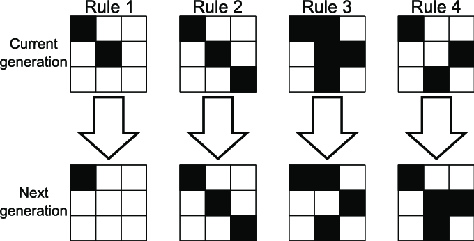

import LabHooksInterval from '@site/src/components/lab-solutions/lab-hooks/lab-hooks-interval/App';
import LabHooksPokemonPokedex from '@site/src/components/lab-solutions/lab-hooks/lab-hooks-pokemon-pokedex/App';
import LabHooksLocalStorage from '@site/src/components/lab-solutions/lab-hooks/lab-hooks-local-storage/App';
import ReactPlayer from 'react-player';
import LabHooksGameOfLife from '@site/src/components/lab-solutions/lab-hooks/lab-hooks-game-of-life/App';
import LabHooksUseInterval from '@site/src/components/lab-solutions/lab-hooks/lab-hooks-use-interval/App';

# Labo 6

- Hooks

## 1. Interval

> 📂 **Naam project:** `lab-hooks-interval`  
> 🔗 **Basis project:** n/a

Maak een nieuwe React applicatie aan en noem deze `lab-hooks-interval`.
            
Maak de volgende componenten aan:

- Het `Timer` component. Dit component toont de tijd in seconden die verstreken is sinds de component is getoond. 
- Het `CurrentTime` component. Dit component toont de huidige tijd in het formaat `hh:mm:ss`.
- Het `RandomValue` component. Dit component toont een willekeurig getal tussen `min` en `max`.
- Alle componenten gebruiken `setInterval` om de tijd te updaten. Gebruik de `useEffect` hook om dit te doen.

    <LabHooksInterval/>

### Oplossingsvideo

<ReactPlayer controls url='https://youtu.be/QQA4PXp967c'/>

## 2. Pokemon

> 📂 **Naam project:** `lab-hooks-pokemon-pokedex`  
> 🔗 **Basis project:** n/a

Maak een nieuwe React applicatie aan en noem deze `lab-hooks-pokemon-pokedex`.

- Maak een component `Pokedex` aan met als property `limit` die het aantal pokemon aangeeft dat getoond moet worden. Initieel mag je die property op 151 zetten.
- Maak gebruik van de `https://pokeapi.co/` om deze pokemon op te halen op het moment dat de component gemounted wordt. Gebruik de `useEffect` hook om dit te doen.
- Zorg voor een loading indicator die getoond wordt tot de data geladen is.
- Plaats een invoer veld bovenaan de lijst van pokemon. Deze filtert de lijst van pokemon op naam. De filtering gebeurd op het moment dat de gebruiker een letter intypt. 
- Plaats een invoerveld onderaan de lijst die aangeeft hoeveel pokemon er getoond mogen worden. Je dient deze filtering aan de hand van de `limit` query parameter te doen van de API. Pas vanaf de gebruiker op de button klikt, wordt de lijst van pokemon opnieuw opgehaald.

<LabHooksPokemonPokedex/>

## 3. LocalStorage

> 📂 **Naam project:** `lab-hooks-local-storage`  
> 🔗 **Basis project:** n/a

Maak een nieuwe React applicatie aan en noem deze `lab-hooks-local-storage`.

- Maak een nieuw component `DadJoke` aan. 
- Maak een functie loadJoke die een "awkward dad joke" ophaalt van de API `https://icanhazdadjoke.com/`. Gebruik de `fetch` API om de data op te halen. Plaats het resultaat in een state van het component.
- Zorg ervoor dat de functie wordt opgeroepen wanneer het component gemounted wordt. Gebruik de `useEffect` hook om dit te doen.
- Eenmaal de data geladen is, toon je de joke in een `
` element. Zorg voor een kaartje waarin de joke getoond wordt.
- Plaats een button `New Joke` onderaan de joke. Wanneer de gebruiker op deze button klikt, wordt er een nieuwe joke opgehaald.
- Plaats een button `Set as favorite` onderaan de joke. Wanneer de gebruiker op deze button klikt, wordt de huidige joke (als string) opgeslagen in de `localStorage` van de browser. 
- Bij het opstarten van de applicatie, wordt de laatst opgeslagen joke getoond. Gebruik hiervoor de `useEffect` hook.

<LabHooksLocalStorage/>

### Oplossingsvideo

<ReactPlayer controls url='https://youtu.be/-ZCPmx5HGvA'/>

## 4. useInterval hook

> 📂 **Naam project:** `lab-hooks-use-interval`  
> 🔗 **Basis project:** n/a

Maak een nieuw React project aan en noem deze `lab-hooks-use-timeout`. Schrijf een `useInterval` hook die een functie aanroept elke `delay` milliseconden. De hook moet de volgende parameters aanvaarden:
- `callback`: de functie die aangeroepen wordt elke `delay` milliseconden
- `delay`: het aantal milliseconden tussen elke aanroep van de `callback`

Je moet het interval kunnen aan- en uitzetten door een `running` state te gebruiken. Wanneer `running` op `true` staat, wordt de `callback` elke `delay` milliseconden aangeroepen. Wanneer `running` op `false` staat, wordt de `callback` niet aangeroepen.

Het moet ook mogelijk zijn om de `delay` te veranderen. Wanneer de `delay` verandert, moet het interval opnieuw ingesteld worden met de nieuwe `delay`.

Schrijf een eenvoudig webapplicatie die de `useInterval` hook gebruikt om een teller te maken die elke seconde verhoogd wordt. De applicatie moet ook een button hebben om het interval aan- en uit te zetten. En een invoerveld om de `delay` te veranderen.

<LabHooksUseInterval/>

## 5. Game of Life (2)

> 📂 **Naam project:** `lab-hooks-game-of-life`  
> 🔗 **Basis project:**  [`lab-state-array-game-of-life`](lab5.md#8-game-of-life-1)

Maak een kopie van de Game of Life van het vorige labo (lab-state-array-game-of-life) naar een nieuw project en noem deze `lab-hooks-game-of-life`.

Voeg een functie `step` toe die 1 stap van de Game Of Life uitvoert. Deze functie wordt aangeroepen telkens als de gebruiker op een `STEP` button klikt.

De regels van de Game of Life zijn als volgt:
- Rule 1: Een levende cel met minder dan 2 levende buren sterft (onderbevolking).
- Rule 2: Een levende cel met 2 of 3 levende buren blijft leven.
- Rule 3: Een levende cel met meer dan 3 levende buren sterft (overbevolking).
- Een dode cel met precies 3 levende buren wordt een levende cel (reproductie).

Maak ook een `PLAY` button die de `step` functie elke seconde aanroept. Maak ook een `STOP` button die dit stopt.

<LabHooksGameOfLife/>

