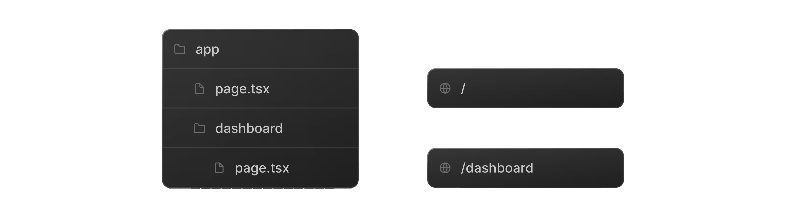
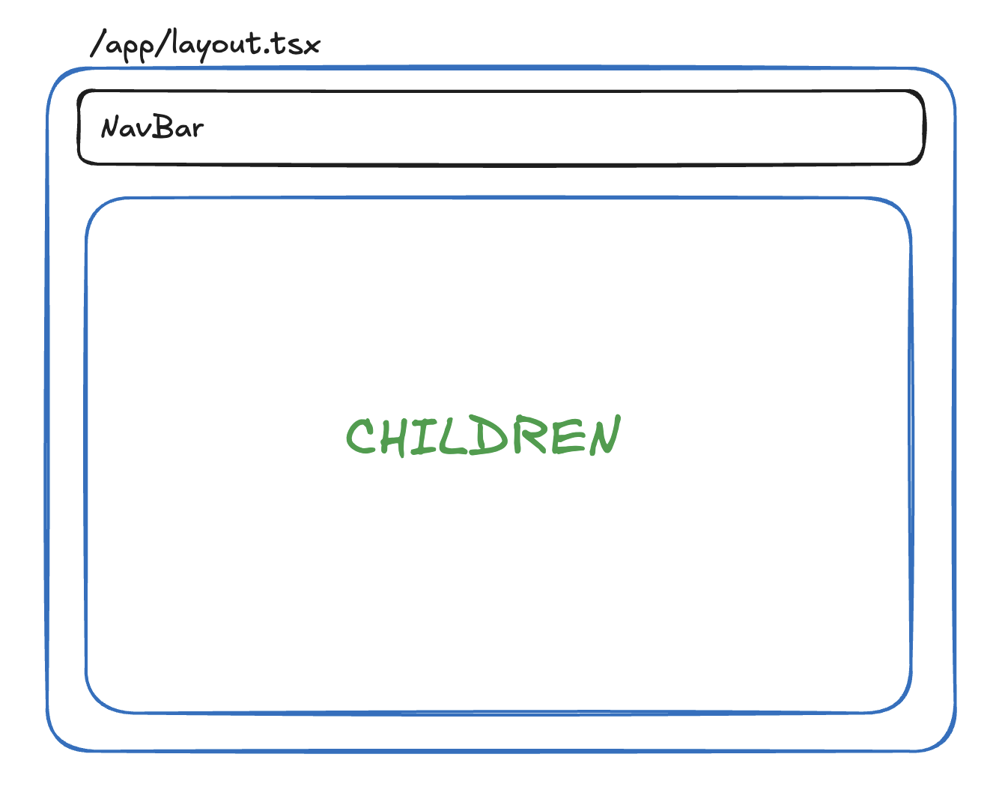
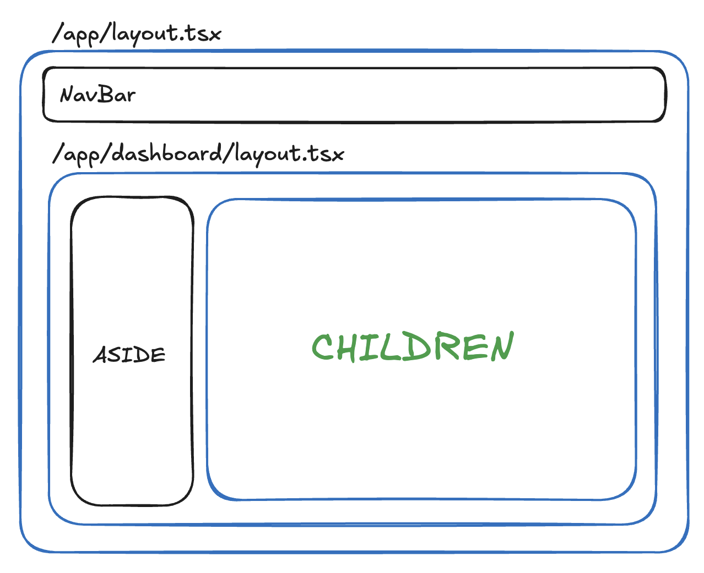

# Routing

Tot nu toe bestonden onze applicaties uit één enkele pagina. Dit is niet erg handig als je een volledige website wil maken. Daarom is er een manier nodig om meerdere pagina's te maken. Dit kan met behulp van een router. Een router is een stukje code dat bepaalt welke pagina getoond moet worden op basis van de URL. 

In het onderdeel React.js hebben we gebruik gemaakt van een declaratieve manier om routes te definiëren met behulp van de bibliotheek React Router. Je beschrijft dan in je code welke componenten bij welke URL's horen. Dit is een goede manier om routes te definiëren, maar het heeft als nadeel dat je aanzienlijke hoeveelheid code moet schrijven om de router te configureren. 

## File-system based router

Next.js maakt gebruik van een zogenaamde "file-system based" router. Dit betekend dat we geen extra code moeten schrijven om de router te configureren. We moeten enkel een aantal bestanden en directories aanmaken en de router zal automatisch de juiste pagina tonen op basis van het pad. 

Als je een nieuw Next.js project aanmaakt met `npx create-next-app@latest` dan zal er automatisch een `app` directory aangemaakt worden. In deze directory kan je nieuwe bestanden en directories aanmaken om nieuwe routes te maken. Er wordt ook al een `page.tsx` bestand aangemaakt in de `app` directory. 

### Nieuwe routes maken

Als je bijvoorbeeld een pagina wilt aanbieden op het pad `/about`, dan kan je een nieuwe directory `about` aanmaken in de `app` directory en daar een nieuw bestand `page.tsx` aanmaken. Je kan hier zo diep gaan als je zelf wil. Wil je bijvoorbeeld een pagina aanbieden op het pad `/dashboard/invoices`, dan kan je een directory `dashboard` aanmaken in de `app` directory en daar een nieuwe directory `invoices` aanmaken. In deze directory kan je dan een nieuw bestand `page.tsx` aanmaken. 



### Link component

Om te navigeren tussen de verschillende pagina's kan je gebruik maken van het `Link` component dat meegeleverd wordt met Next.js. Dit component zorgt ervoor dat de navigatie gebeurt zonder dat de pagina volledig herladen wordt. Dit zorgt voor een betere gebruikerservaring. Als je gewoon een `<a>` element gebruikt, dan zal de pagina volledig herladen worden. 

Als we bijvoorbeeld een navigatiebalk willen maken die op de root pagina getoond wordt, dan kunnen we een nieuwe component `NavBar` maken en deze toevoegen aan de `layout.tsx` bestand in de `app` directory. 

```typescript
import Link from "next/link";

const NavBar = () => {
  return (
    <nav>
      <Link href="/">Home</Link>
      <Link href="/about">About</Link>
      <Link href="/dashboard/invoices">Invoices</Link>
    </nav>
  );
};
```

Je kan in principe zelf kiezen waar je de `NavBar` component aanmaakt in de directory structuur van je project. Je kan deze bijvoorbeeld in de `src/components` directory plaatsen. Er wordt ook vaak gekozen om de componenten bij de pagina's te plaatsen waar ze gebruikt worden. In dit geval zou je de `NavBar` component in de `app` directory kunnen plaatsen.

#### Active links

Om aan te geven welke link actief is, kan je gebruik maken van de `usePathname` hook die meegeleverd wordt met Next.js. Deze hook geeft de huidige pathname terug. Je kan deze gebruiken om te bepalen welke link actief is en deze een andere stijl te geven. Deze werkt enkel in client componenten dus meestal zijn navigatiebalken client componenten.

```typescript
"use client";

import Link from "next/link";
import { usePathname } from "next/navigation";

interface NavLinkProps {
  href: string;
  label: string;
}

const NavLink = ({href, label} : NavLinkProps) => {
  const pathname = usePathname();
  return (
    <Link href={href} className={`px-3 py-2 rounded-md text-sm font-medium ${pathname === href ? "bg-blue-600 text-white" : "text-gray-700 hover:bg-gray-200 hover:text-black"}`}>
        {label}
    </Link>
  )
}

const NavBar = () => {
  return (
    <nav>
      <NavLink href="/" label="Home" />
      <NavLink href="/about" label="About" />
      <NavLink href="/dashboard/invoices" label="Invoices" />
    </nav>
  );
};

export default NavBar;
```

### Layouts maken

Je kan ook gebruik maken van layouts om gedeelde componenten te maken die op meerdere pagina's gebruikt worden. Dit is handig als je bijvoorbeeld een navigatiebalk of een footer wil maken die op alle pagina's getoond wordt. Je kan dit doen door een nieuw bestand `layout.tsx` aan te maken in de directory waar je de layout wil gebruiken. Dus als je een layout wil maken die op alle pagina's gebruikt wordt, dan kan je een nieuw bestand `layout.tsx` aanmaken in de `app` directory. 

```
app/layout.tsx → layout voor alle pagina's
``` 

Elke nieuwe next applicatie die je aanmaakt met `npx create-next-app@latest` heeft al een `layout.tsx` bestand in de `app` directory. Vereenvoudigd ziet dit bestand er als volgt uit:

```typescript
const RootLayout = ({ children }: { children: React.ReactNode }) => {
  return (
    <html lang="en">
      <body>{children}</body>
    </html>
  );
};

export default RootLayout;
```

Je ziet hier dat de layout een component is die een `children` prop verwacht. Deze prop bevat de inhoud van de pagina die getoond moet worden. In dit geval wordt de inhoud van de pagina in de `body` van het HTML document geplaatst.

Wil je bijvoorbeeld op elke pagina een navigatiebalk tonen, dan kan je dit doen door de navigatiebalk component toe te voegen aan de layout:

```typescript
import NavBar from "@/components/NavBar";

const RootLayout = ({ children }: { children: React.ReactNode }) => {
  return (
    <html lang="en">
      <body>
        <NavBar />
        {children}
      </body>
    </html>
  );
};

export default RootLayout;
```



Je kan ook geneste layouts maken. Dit is handig als je bijvoorbeeld een layout wil maken die alleen op bepaalde pagina's gebruikt wordt. Wil je bijvoorbeeld een layout maken die alleen op de dashboard pagina's gebruikt wordt, dan kan je een nieuw bestand `layout.tsx` aanmaken in de `app/dashboard` directory. 

```
app/dashboard/layout.tsx → layout voor alle dashboard pagina's
```

Stel je voor dat we een speciale layout willen maken voor alle dashboard pagina's. Deze layout kan er als volgt uitzien:

```typescript
import SideBar from "@/components/SideBar";

const DashboardLayout = ({ children }: { children: React.ReactNode }) => {
  return (
    <div style={{ display: "flex" }}>
      <SideBar />
      <div>
        {children}
       </div>
    </div>
  );
};

export default DashboardLayout;
```

Merk hierbij op dat eerst de Layout in de `app` directory wordt toegepast en daarna de layout in de `app/dashboard` directory. Dit betekend dat de `NavBar` component altijd getoond wordt, ook op de dashboard pagina's.

Als je naar /dashboard/invoices navigeert, dan zal de volgende structuur getoond worden:



### Dynamische routes

Je kan ook dynamische routes maken. Dit is handig als je bijvoorbeeld een pagina wil maken die de details van een bepaald item toont. Stel je voor dat we een pagina hebben die een lijst van producten toont. Als je op een product klikt, wil je naar een pagina navigeren die de details van dat product toont. 

Stel dat we een lijst van producten hebben zoals hieronder:

```typescript
interface Product {
  id: number;
  name: string;
}

const products : Product[] = [
  { id: 1, name: "Product 1" },
  { id: 2, name: "Product 2" },
  { id: 3, name: "Product 3" },
];

export default products;
```

We kunnen dan een nieuwe pagina maken die de lijst van producten toont. Dit kan in het bestand `src/app/products/page.tsx`:

```typescript
import Link from "next/link";
import products from "@/data/products";

const ProductsPage = () => {
  return (
    <div>
      <h1>Products</h1>
      <ul>
        {products.map((product) => (
          <li key={product.id}>
            <Link href={`/products/${product.id}`}>{product.name}</Link>
          </li>
        ))}
      </ul>
    </div>
  );
};

export default Products;
```

We gaan hier uiteraard geen drie aparte pagina's maken voor elk product. In plaats daarvan gaan we een dynamische route maken. Dit kan door een nieuwe directory aan te maken in de `app/products` directory met de naam `[id]`. De naam tussen de vierkante haken geeft aan dat dit een dynamische parameter is. In deze directory kunnen we dan een nieuw bestand `page.tsx` aanmaken. 

```typescript
const ProductsDetail = async(props: PageProps<"/products/[id]">) => {
    const { id } = await props.params;

    return (
        <div className="p-4">
            <h1 className="text-2xl font-bold mb-4">Product Detail for ID: {id}</h1>
            <p className="text-lg">This is the detail page for product with ID {id}.</p>
        </div>
    );
}

export default ProductsDetail;
```

Merk op dat we hier een speciaal type `PageProps` gebruiken om de props van de pagina te typeren. Dit type wordt meegeleverd door Next.js en zorgt ervoor dat we toegang hebben tot de dynamische parameters in de URL. In dit geval is er één parameter `id` die we kunnen gebruiken om de details van het product op te halen. Omdat het ophalen van parameters in Next.js asynchroon is, maken we de component `async` en gebruiken we `await` om de parameters op te halen.

Als je deze wil uitlezen in een client component, dan kan je gebruik maken van de `useParams` hook die meegeleverd wordt met Next.js. Deze hook geeft een object terug met de dynamische parameters.

```typescript
"use client";

import { useParams } from "next/navigation";

const ProductDetailClient = () => {
  const params = useParams();
  const { id } = params;

  return (
    <div>
      <h1>Product Detail for ID: {id}</h1>
      <p>This is the detail page for product with ID {id}.</p>
    </div>
  );
};
export default ProductDetailClient;
```

### Search parameters

#### Server component

In een server component (zoals een pagina of layout) kan je ook gebruik maken van search parameters (of query parameters). Dit zijn de parameters die in de URL staan na het vraagteken (`?`). Stel dat we een pagina hebben die een lijst van producten toont en we willen deze lijst filteren op basis van een zoekterm. We kunnen dan de zoekterm als een search parameter in de URL meegeven, bijvoorbeeld `/products?q=shirt`.

```typescript
const ProductsPage = async(props: PageProps<"/products">) => {
    const searchParams = await props.searchParams;
    const q = typeof searchParams.q === "string" ? searchParams.q : "";
    const filteredProducts = products.filter(product => product.name.startsWith(q));

    return (
      <div>
        <h1>Products</h1>
        <ul>
          {filteredProducts.map((product) => (
            <li key={product.id}>
              <Link href={`/products/${product.id}`}>{product.name}</Link>
            </li>
          ))}
        </ul>
      </div>
    );
}

export default ProductsPage;
```

Opgelet deze dingen zijn enkel mogelijk in server componenten. 

#### Search parameters in client componenten

Om de search parameters te gebruiken in een client component, kan je gebruik maken van de `useSearchParams` hook die meegeleverd wordt met Next.js. Deze hook geeft een `URLSearchParams` object terug dat je kan gebruiken om de search parameters op te halen.

```typescript
"use client";

import { useSearchParams, useRouter } from "next/navigation";

const SearchBox = () => {
  const searchParams = useSearchParams();
  const { replace } = useRouter();
  
  const q = searchParams.get("q") || "";

  const onChange : React.ChangeEventHandler<HTMLInputElement> = (e) => {
    const newQ = e.target.value;
    const params = new URLSearchParams(searchParams.toString());
    if (newQ) {
      params.set("q", newQ);
    } else {
      params.delete("q");
    }
    replace(`?${params.toString()}`);
  };

  return (
    <input
      type="text"
      value={q}
      onChange={onChange}
      defaultValue={searchParams.get('query')?.toString()}
      placeholder="Search..."
    />
  );
};

export default SearchBox;
```