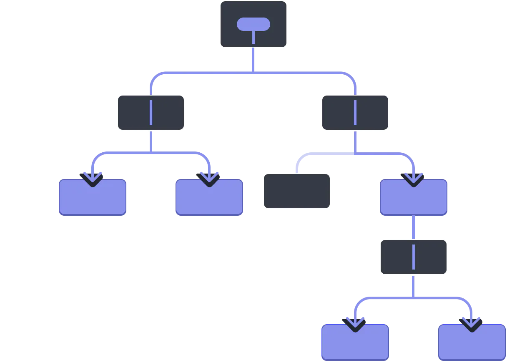

# Context

## Delen van data via context

In een React applicatie wordt data van het bovenste component doorgegeven naar het onderste component aan de hand van props. Dit is mogelijk in een applicatie waar de component structuur niet heel diep is, maar naar mate de applicatie groeit, groeit meestal ook de diepte van je componenten structuur. Je zal dan vaak een prop verschillende niveau's diep moeten doorgeven. Dit concept heet property drilling, en is in grote applicaties niet wenselijk.



Stel dat we een light theme en een dark theme willen ondersteunen in onze applicatie. Elk component heeft deze prop nodig want elk component moet zijn UI aanpassen als de theme light of dark is. 

Hieronder kan je een voorbeeld hiervan zien:

```typescript codesandbox={"template": "react", "filename": "src/App.tsx"}
//hide-start
import { useState } from "react";

const getThemeStyle = (theme: string, color: string) => {
    return { backgroundColor: theme === "dark" ? "black" : "white", padding: 10, border: "10px solid " + color }
}
//hide-end
const ComponentA = ({ theme }: { theme: string }) => {
  return (
    <div style={getThemeStyle(theme, "red")}>
      <ComponentB theme={theme} />
    </div>
  );
};
const ComponentB = ({ theme }: { theme: string }) => {
  return (
    <div style={getThemeStyle(theme, "green")}>
      <ComponentC theme={theme} />
    </div>
  );
};
const ComponentC = ({ theme }: { theme: string }) => {
  return (
    <div style={getThemeStyle(theme, "blue")}>
      <ComponentD theme={theme} />
    </div>
  );
};
const ComponentD = ({ theme }: { theme: string }) => {
  return <p style={{color: theme === "dark" ? "white" : "black"}}>{theme}</p>;
};

const App = () => {
  const [theme, setTheme] = useState("light");
  
  return (
    <>
      <button onClick={()=>{ setTheme(theme => theme == "dark" ? "light" : "dark")}}>Toggle theme!</button>
      <ComponentA theme={theme} />
    </>
  );
};
//hide-start
export default App;
//hide-end
```

Je ziet dat zelfs voor een kleine applicatie, zoals die hierboven, dat we deze theme prop al moeten doorgeven doorheen 3 niveaus van componenten. Bij grotere applicaties gaat dit nog veel erger worden. Daarom heeft React voor de Context API gezorgd. Dit is een manier om data te gaan delen doorheen componenten zonder door heel de structuur te moeten doorgegeven worden. Dit is zeer handig als de tussenliggende lagen geen nood hebben aan deze data. Deze hoeven dan ook niet de context te gebruiken.


Het eerste wat we moeten doen is een Context aanmaken aan de hand van de createContext

```typescript
interface IThemeContext {
    theme: string
}

export const ThemeContext = React.createContext<IThemeContext>({theme: 'light'});
```

Je moet altijd een default waarde meegeven aan de context. Deze default waarde wordt enkel gebruikt als er geen provider aanwezig is bovenaan in de component structuur. We geven hier een object met een mode property. Dus in ons geval zal onze layout dus standaard in light mode staan.

Nu moeten we een Provider maken van onze ThemeContext zodat we de values kunnen meegeven die we in de componenten willen gebruiken. De provider moet rond de bovenste component staan die onze context willen gebruiken.

```typescript
const App = () => {
  const [theme, setTheme] = useState("light");

  return (
    <ThemeContext.Provider value={{theme: theme}}>
       <...>

       </...>
    </ThemeContext.Provider>
  );
};
```

Nu kan je de values van de ThemeContext provider opvragen aan de hand van de `useContext` hook. 

```typescript codesandbox={"template": "react", "filename": "src/App.tsx"}
//hide-start
import React, { useState, useContext } from "react";

interface IThemeContext {
    theme: string
}
export const ThemeContext = React.createContext<IThemeContext>({theme: 'light'});

const getThemeStyle = (theme: string, color: string) => {
  return { backgroundColor: theme === "dark" ? "black" : "white", padding: 10, border: "10px solid " + color }
}
//hide-end
const ComponentA = () => {
  const {theme} = useContext(ThemeContext);
  return (
    <div style={getThemeStyle(theme, "red")}>
      <ComponentB/>
    </div>
  );
};
const ComponentB = () => {
  const {theme} = useContext(ThemeContext);
  return (
    <div style={getThemeStyle(theme, "green")}>
      <ComponentC />
    </div>
  );
};
const ComponentC = () => {
  const {theme} = useContext(ThemeContext);
  return (
    <div style={getThemeStyle(theme, "blue")}>
      <ComponentD  />
    </div>
  );
};
const ComponentD = () => {
  const {theme} = useContext(ThemeContext);
  return <p style={{color: theme === "dark" ? "white" : "black"}}>{theme}</p>;
};

const App = () => {
  const [theme, setTheme] = useState("light");

  return (
    <ThemeContext.Provider value={{theme: theme}}>
        <>
            <button onClick={()=>{ setTheme(theme => theme == "dark" ? "light" : "dark")}}>Toggle theme!</button>
            <ComponentA />
        </>
    </ThemeContext.Provider>
  );
};
//hide-start
export default App;
//hide-end
```

Je ziet nu dat elk component toegang heeft tot de mode variabele die we in de context hebben aangeboden zonder dat we deze moeten doorgeven doorheen de component hierarchie.

## Functies in context

We kunnen ook functies toevoegen in onze `ThemeContext` zodat we bijvoorbeeld ook vanuit elk component de theme kunnen aanpassen. We voegen nu aan de createContext functie een setMode functie toe. We moeten hier een default value voor aanbieden, op dit moment hebben we nog geen handler dus we geven een lege functie mee.

```typescript
interface IThemeContext {
    theme: string,
    setTheme: (theme: string) => void
}

export const ThemeContext = React.createContext<IThemeContext>({theme: "light", setTheme: (theme: string) => {}});
```

We geven hier bij de createContext een interface mee tussen de `<>` haken zodat TypeScript weet welke keys er in de context zullen voorkomen en welke types deze hebben.

Als we nu de `setTheme` functie (van de useState) meegeven aan de provider dan is deze functie beschikbaar in elk component.

```typescript {2} codesandbox={"template": "react", "filename": "src/App.tsx"}
//hide-start
import React, { useState, useContext } from "react";

interface IThemeContext {
    theme: string,
    setTheme: (theme: string) => void
}
export const ThemeContext = React.createContext<IThemeContext>({theme: 'light', setTheme: (theme: string)=>{}});

const getThemeStyle = (theme: string, color: string) => {
  return { backgroundColor: theme === "dark" ? "black" : "white", padding: 10, border: "10px solid " + color }
}

const ComponentA = () => {
  const {theme} = useContext(ThemeContext);
  return (
    <div style={getThemeStyle(theme, "red")}>
      <ComponentB/>
    </div>
  );
};
const ComponentB = () => {
  const {theme} = useContext(ThemeContext);
  return (
    <div style={getThemeStyle(theme, "green")}>
      <ComponentC />
    </div>
  );
};
const ComponentC = () => {
  const {theme} = useContext(ThemeContext);
  return (
    <div style={getThemeStyle(theme, "blue")}>
      <ComponentD  />
    </div>
  );
};
//hide-end
const ComponentD = () => {
  const {theme,setTheme} = useContext(ThemeContext);
  return <button onClick={() => { setTheme(theme === "dark" ? "light" : "dark")}} style={{backgroundColor: theme === "dark" ? "black" : "white", color: theme === "dark" ? "white" : "black"}}>{theme}</button>;
};
//hide-start
const App = () => {
  const [theme, setTheme] = useState("light");

  return (
    <ThemeContext.Provider value={{theme: theme, setTheme: setTheme}}>
        <>
            <button onClick={()=>{ setTheme(theme => theme == "dark" ? "light" : "dark")}}>Toggle theme!</button>
            <ComponentA />
        </>
    </ThemeContext.Provider>
  );
};
export default App;
//hide-end
```

## Data Context

Een veel voorkomend patroon is dat je data vanuit een API ophaalt en deze data dan doorgeeft aan verschillende componenten. Dit kan je doen door de data in de state van de bovenste component te plaatsen en deze dan door te geven aan de onderliggende componenten. Je zou dit kunnen doen aan de hand van props, maar dit is niet altijd even handig. Dit wordt meestal gedaan aan de hand van de Context API.

In dit voorbeeld gaan we gebruik maken van de API op https://jsonplaceholder.typicode.com/posts. Deze API geeft een lijst van posts terug. We maken een interface aan voor een post.

```typescript
export interface Post {
    userId: number;
    id: number;
    title: string;
    body: string;
}
```

Om onze code wat overzichtelijker te maken gaan we alle code die te maken heeft met de data van de API in een apart bestand plaatsen. We noemen dit bestand `dataContext.tsx`.

```typescript
import React, { useState, useContext, useEffect } from "react";

export interface DataContext {
  posts: Post[];
  loading: boolean;
  loadData: () => void;
}

export const DataContext = React.createContext<DataContext>({posts: [], loading: false, loadData: () => {}});

export const DataProvider = ({children}: {children: React.ReactNode}) => {
  const [posts, setPosts] = useState<Post[]>([]);
  const [loading, setLoading] = useState<boolean>(false);

  useEffect(() => {
    let cancel = false;
    const loadData = async () => {
        setLoading(true);
        const response = await fetch("https://jsonplaceholder.typicode.com/posts");
        const json = await response.json();
        if (cancel) return;
        setPosts(json);
        setLoading(false);
    }
    loadData();

    return () => {
        cancel = true;
    }
  }, []);

  return (
      <DataContext.Provider value={{posts: posts, loadData: loadData, loading: loading}}>
          {children}
      </DataContext.Provider>
  )
}
```

In de `DataProvider` component maken we een state aan voor de posts. We maken ook een functie aan om de data op te halen van de API. Deze functie wordt aangeroepen in de `useEffect` hook zodat de data wordt opgehaald als de component gemount wordt. We geven de posts en de `reload` functie mee aan de provider zodat deze beschikbaar zijn in de onderliggende componenten. We voorzien ook een loading property zodat we kunnen zien of de data aan het laden is of niet.

Nu kunnen we de `DataProvider` component gebruiken in onze `App` component. Je kan zien dat het nu zeer eenvoudig is de data te gebruiken in de onderliggende componenten. We moeten enkel de `useContext` hook gebruiken om de data op te halen.

```typescript codesandbox={"template": "react", "filename": "src/App.tsx"}
//hide-start
import React, { useEffect, useState } from 'react';
import { useContext } from 'react';

export interface Post {
  userId: number;
  id: number;
  title: string;
  body: string;
}

export interface DataContext {
  posts: Post[];
  loading: boolean;
  reload: () => void;
}

export const DataContext = React.createContext<DataContext>({posts: [], loading: false, reload: () => {}});

export const DataProvider = ({children}: {children: React.ReactNode}) => {
  const [posts, setPosts] = useState<Post[]>([]);
  const [loading, setLoading] = useState<boolean>(false);
  const [trigger, setTrigger] = useState<number>(0);

  useEffect(() => {
    const loadData = async () => {
        setLoading(true);
        setPosts([]);
        const response = await fetch("https://jsonplaceholder.typicode.com/posts");
        const json = await response.json();
        setPosts(json);
        setLoading(false);
    }
    loadData();
  }, [trigger]);

  const reload = () => {
    setTrigger(trigger + 1); 
  }

  return (
      <DataContext.Provider value={{posts: posts, reload: reload, loading: loading}}>
          {children}
      </DataContext.Provider>
  )
}
//hide-end
const ReloadButton = () => {
  const { reload, loading } = useContext(DataContext);
  return (
    <button disabled={loading} onClick={() => reload()}>reload</button>
  )
}

const PostList = () => {
  const { posts } = useContext(DataContext);
  return (
    <div>
      <h1>Posts</h1>
      <ul>
        {posts.map((post, index) => (
          <li key={index}>{post.title}</li>
        ))}
      </ul>
    </div>
  )
}

const App = () => {
  return (
    <DataProvider>
      <ReloadButton/>
      <PostList/>
    </DataProvider>
  )
}

//hide-start
export default App
//hide-end
```

Het is ook mogelijk om functies toe te voegen om de data te gaan aanpassen. Zo kan je functies voorzien om posts toe te voegen, te verwijderen of te updaten. Deze functies worden dan ook meegegeven aan de provider zodat deze beschikbaar zijn in de onderliggende componenten. Je kan dit in de array zelf doen of een POST request maken naar een backend.

```typescript
const createPost = async (post: Post) => {
  setPosts([...posts, post]);
  await fetch("https://jsonplaceholder.typicode.com/posts", {
    method: "POST",
    body: JSON.stringify(post),
    headers: {
      "Content-type": "application/json; charset=UTF-8"
    }
  });
}
```

Vergeet niet om de `createPost` functie mee te geven aan de provider.

```tsx
<DataContext.Provider value={{posts: posts, loadData: loadData, loading: loading, createPost: createPost}}>
```

Het volledige voorbeeld kan je hier vinden:

```typescript codesandbox={"template": "react-context", "filename": "src/App.tsx"}
import { DataProvider } from './providers/DataProvider';
import ReloadButton from './components/ReloadButton';
import PostForm from './components/PostForm';
import PostList from './components/PostList';

const App = () => {
  return (
    <DataProvider>
      <PostForm/>
      <ReloadButton/>
      <PostList/>
    </DataProvider>
  )
}

export default App
```

## ThemeProvider

Ook ons voorbeeld van de light/dark theme kan je aan de hand van een aparte provider maken. 

```typescript codesandbox={"template": "react", "filename": "src/App.tsx"}
import { createContext, useState, type ReactNode } from "react";

export type Theme = "dark" | "light";

interface IThemeContext {
    theme: Theme;
    toggle: () => void
}

export const ThemeContext = createContext<IThemeContext>({theme: "light", toggle: () => {}});

const ThemeProvider = ({children}: {children: ReactNode}) => {
    const [theme, setTheme] = useState<Theme>("light");

    const toggle = () => {
        setTheme(theme => theme === "dark" ? "light" : "dark");
    }

    return (
        <ThemeContext.Provider value={{ theme: theme, toggle: toggle }}>
            {children}
        </ThemeContext.Provider>
    )
}

export default ThemeProvider;
```

Dan kan je eenvoudig de `ThemeProvider` gebruiken in je `App` component of je `main.tsx` bestand.

```typescript
import { StrictMode } from 'react'
import { createRoot } from 'react-dom/client'
import './index.css'
import App from './App.tsx'
import ThemeProvider from "./providers/ThemeProvider.tsx"

createRoot(document.getElementById('root')!).render(
  <StrictMode>
    <ThemeProvider>
        <App />
    </ThemeProvider>
  </StrictMode>,
)
```
