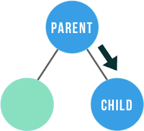
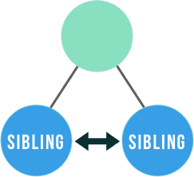
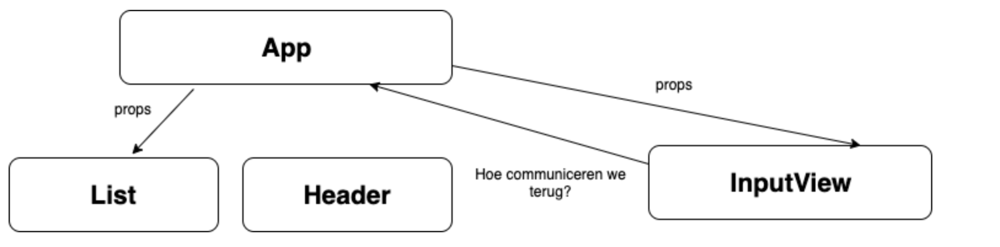

# Callbacks en properties

:::warning
Communicatie tussen verschillende componenten is een van de moeilijkste dingen in React. We raden je aan om altijd eerst zoveel mogelijk te werken met grote componenten en die dan pas op te splitsen alles functioneel is. Zo kan je vaak voorkomen dat je verschillende componenten nodig hebt.
:::

## Parent, child en siblings

Vooraleer we gaan bespreken hoe deze componenten gaan kunnen communiceren moeten we even definieren wat parent (ouder), child (kind) en siblings (broers en zussen) zijn. 

```typescript codesandbox={"template": "react", "filename": "src/App.tsx"}
//hide-start
const StyleA = {
    border: "2px solid blue",
    padding: 10,
    margin: 5
}

const StyleB = {
    border: "2px solid green",
    padding: 10,
    margin: 5
}

const StyleC = {
    border: "2px solid red",
    padding: 10,
    margin: 5
}
//hide-end
const ComponentC = () => {
    return <div style={StyleC}><p>Component C</p></div>
}

const ComponentB = () => {
    return <div style={StyleB}><p>Component B</p></div>
}

const ComponentA = () => {
    return (<div style={StyleA}>
        <p>Component A</p>
        <ComponentB/>
        <ComponentC/>
    </div>
    )
}
//hide-start
const App = () => {
  return <ComponentA/>
}

export default App;
//hide-end
```

We zeggen hier dat `ComponentA` de parent is van `ComponentB` en `ComponentC`. `ComponentB` en `ComponentC` zijn dan de child components van `ComponentA`. `ComponentB` en `ComponentC` noemen we siblings.

## Parent-to-child communicatie



### Via props

We hebben tot nu toe geleerd hoe we data kunnen doorgeven aan een component aan de hand van props. Eigenlijk is dit communicatie tussen het Parent en het Child component. 

```typescript codesandbox={"template": "react", "filename": "src/App.tsx"}
//hide-start
interface ChildProps {
    someProperty: any
}
//hide-end
const Child = ({someProperty}: ChildProps) => {
    return <div>{someProperty}</div>
}

const Parent = () => {
    return <Child someProperty={5}/>
}
//hide-start
const App = () => {
    return <Parent/>
}

export default App;
//hide-end
```

### Voorbeeld

Stel dat we het uitzicht van de twee child componenten willen aanpassen als we op de parent drukken. Dan kunnen we een property `mouseDown` toevoegen aan de child components waar we kunnen doorgeven dat het parent component is ingedrukt. Uiteraard hebben we hier ook een state nodig in het parent component om bij te houden dat het component is ingedrukt of niet.

```typescript codesandbox={"template": "react", "filename": "src/App.tsx"}
//hide-start
import {useState} from "react";

const StyleA = {
    border: "2px solid blue",
    padding: 10,
    margin: 5
}

const StyleB = {
    border: "2px solid green",
    padding: 10,
    margin: 5
}

const StyleC = {
    border: "2px solid red",
    padding: 10,
    margin: 5
}

interface ChildProps {
    mouseDown: boolean
}
//hide-end
const ComponentC = ({mouseDown} : ChildProps) => {
    let style = mouseDown ? {...StyleC, backgroundColor: "red"} : StyleC;
    return <div style={style}><p>Component C</p></div>
}

const ComponentB = ({mouseDown} : ChildProps) => {
    let style = mouseDown ? {...StyleB, backgroundColor: "green"} : StyleB;
    return <div style={style}><p>Component B</p></div>
}

const ComponentA = () => {
    const [mouseDown, setMouseDown] = useState(false);
    return (<div style={StyleA} onMouseDown={() => setMouseDown(true)} onMouseUp={() => setMouseDown(false)}>
        <p>Component A</p>
        <ComponentB mouseDown={mouseDown}/>
        <ComponentC mouseDown={mouseDown}/>
    </div>
    )
}
//hide-start
const App = () => {
  return <ComponentA/>
}

export default App;
//hide-end
```

## Child-to-parent communicatie


### Via callback functies

Willen we nu kunnen communiceren vanuit de child componenten naar de parent component dan is dit iets complexer. De eenvoudigste manier om dit te doen is door een functie door tegeven vanuit de parent naar het child component. Het child component kan die functie dan gebruiken om te communiceren met de parent. Dit concept noemen we callback functies

```typescript codesandbox={"template": "react", "filename": "src/App.tsx"}
interface ChildProps {
    callbackFunction: () => void
}

const Child = ({callbackFunction}: ChildProps) => {
    return <div><button onClick={callbackFunction}>Click me</button></div>
}

const Parent = () => {
    return <Child callbackFunction={() => { console.log("Child was clicked"); }}/>
}
//hide-start
const App = () => {
    return <Parent/>
}

export default App;
//hide-end
```

### Voorbeeld

We passen het voorbeeld van hiervoor aan zodat de logica nu omgekeerd is. Als we op de child component klikken dan moet de parent component van kleur veranderen. Dus we voorzien een callback `onMouse` met een argument `down` die we dan doorgeven aan de child componenten. Als er iemand dan duwt op het child component wordt deze `onMouse` handler aangeroepen. Deze zorgt ervoor dat de `mouseDown` state wordt aangepast afhankelijk of de muis ingedrukt is of niet.

```typescript codesandbox={"template": "react", "filename": "src/App.tsx"}
//hide-start
import {useState} from "react";

const StyleA = {
    border: "2px solid blue",
    backgroundColor: "white",
    padding: 10,
    margin: 5
}

const StyleB = {
    border: "2px solid green",
    backgroundColor: "white",
    padding: 10,
    margin: 5
}

const StyleC = {
    backgroundColor: "white",
    border: "2px solid red",
    padding: 10,
    margin: 5
}
//hide-end
interface ChildProps {
    onMouse: (down: boolean) => void
}

const ComponentC = ({onMouse} : ChildProps) => {
    return <div onMouseDown={() => onMouse(true)} onMouseUp={() => onMouse(false)} style={StyleC}><p>Component C</p></div>
}

const ComponentB = ({onMouse} : ChildProps) => {
    return <div onMouseDown={() => onMouse(true)} onMouseUp={() => onMouse(false)} style={StyleB}><p>Component B</p></div>
}

const ComponentA = () => {
    const [mouseDown, setMouseDown] = useState(false);
    const mouseHandler = (down: boolean) => {
        setMouseDown(down);
    }
    let style = {...StyleA, ...mouseDown ? { backgroundColor: "blue"} : {}}
    return (<div style={style}>
        <p>Component A</p>
        <ComponentB onMouse={mouseHandler}/>
        <ComponentC onMouse={mouseHandler}/>
    </div>
    )
}
//hide-start
const App = () => {
  return <ComponentA/>
}

export default App;
//hide-end
```

## Sibling communicatie



Ook communicatie tussen siblings is mogelijk. Dit gebeurt dan via de parent die de staat van beide componenten bij zal houden. Het is een beetje een combinatie van de bovenstaande twee.

```typescript codesandbox={"template": "react", "filename": "src/App.tsx"}
//hide-start
import {useState} from "react";

const StyleA = {
    border: "2px solid blue",
    backgroundColor: "white",
    padding: 10,
    margin: 5
}

const StyleB = {
    border: "2px solid green",
    backgroundColor: "white",
    padding: 10,
    margin: 5
}

const StyleC = {
    backgroundColor: "white",
    border: "2px solid red",
    padding: 10,
    margin: 5
}
//hide-end
interface ChildProps {
    onMouse: (down: boolean) => void;
    mouseDown: boolean;
}

const ComponentC = ({mouseDown, onMouse} : ChildProps) => {
    let style = mouseDown ? {...StyleC, backgroundColor: "red"} : StyleC;
    return <div style={style} onMouseDown={() => onMouse(true)} onMouseUp={() => onMouse(false)}><p>Component C</p></div>
}

const ComponentB = ({mouseDown, onMouse} : ChildProps) => {
    let style = mouseDown ? {...StyleB, backgroundColor: "green"} : StyleB;
    return <div style={style} onMouseDown={() => onMouse(true)} onMouseUp={() => onMouse(false)}><p>Component B</p></div>
}

const ComponentA = () => {
    const [mouseDownB, setMouseDownB] = useState(false);
    const [mouseDownC, setMouseDownC] = useState(false);
    
    return (<div style={StyleA}>
        <p>Component A</p>
        <ComponentB mouseDown={mouseDownC} onMouse={(down) => { setMouseDownB(down)}}/>
        <ComponentC mouseDown={mouseDownB} onMouse={(down) => { setMouseDownC(down)}}/>
    </div>
    )
}
//hide-start
const App = () => {
  return <ComponentA/>
}

export default App;
//hide-end
```

## InputView component

We kunnen deze dingen nu toepassen op ons `InputView` child component. Schematisch zal dit als volgt uitzien:



```typescript
interface InputViewProps {
  onAddClick: (text: string) => void
}
```

Vervolgens voegen we deze properties toe aan het InputView component. En zorgen we ervoor dat deze wordt aangeroepen als we op de button klikken. Als argument voor `text` gebruiken we hier de waarde van de state.

```typescript {1,10} codesandbox={"template": "react", "filename": "src/App.tsx"}
//hide-start
import {useState} from "react";

interface InputViewProps {
  onAddClick: (text: string) => void
}
//hide-end
const InputView = ({onAddClick} : InputViewProps) => {
  const [text, setText] = useState<string>('');

  const handleChange: React.ChangeEventHandler<HTMLInputElement> = (event) => {
    setText(event.target.value);
  }

  const handleClick: React.MouseEventHandler<HTMLButtonElement> = (event) => {
    console.log(`InputView.handleClick: ${text}`);
    onAddClick(text);
  }

  return (
    <>
      <input type="text" id="name" onChange={handleChange} value={text}/>
      <button onClick={handleClick}>Add</button>
    </>
  );
}
//hide-start
const App = () => {
  return (
    <div>
      <InputView onAddClick={(text) => console.log(text)}/>
    </div>
  );
}

export default App;
//hide-end
```

Nu kan je de functie die verantwoordelijk is voor de `onAddClick` af te handelen gewoon doorgeven aan de hand van een property en het argument afprinten op onze console.

```typescript {4} codesandbox={"template": "react", "filename": "src/App.tsx"}
//hide-start
import {useState} from "react";

interface InputViewProps {
  onAddClick: (text: string) => void
}

const InputView = ({onAddClick} : InputViewProps) => {
  const [text, setText] = useState<string>('');

  const handleChange: React.ChangeEventHandler<HTMLInputElement> = (event) => {
    setText(event.target.value);
  }

  const handleClick: React.MouseEventHandler<HTMLButtonElement> = (event) => {
    console.log(`InputView.handleClick: ${text}`);
    onAddClick(text);
  }

  return (
    <>
      <input type="text" id="name" onChange={handleChange} value={text}/>
      <button onClick={handleClick}>Add</button>
    </>
  );
}
//hide-end
const App = () => {
  return (
    <div>
      <InputView onAddClick={(text) => console.log(`App.onAddClick: ${text}`)}/>
    </div>
  );
}
//hide-start
export default App;
//hide-end
```

Uiteraard hadden we deze `console.log` ook kunnen uitvoeren in ons `InputView` component dus op dit moment lijkt het allemaal een beetje overbodig. 

We voorzien nu een lijst in het App component dat een aantal Todo's zal bijhouden. Dit doen we aan de hand van een state. Het `InputView` component heeft geen toegang tot die state, dus moet het wel via de callback handler van hierboven gebeuren:

```typescript codesandbox={"template": "react", "filename": "src/App.tsx"}
//hide-start
import {useState} from "react";

interface InputViewProps {
  onAddClick: (text: string) => void
}

const InputView = ({onAddClick} : InputViewProps) => {
  const [text, setText] = useState<string>('');

  const handleChange: React.ChangeEventHandler<HTMLInputElement> = (event) => {
    setText(event.target.value);
  }

  const handleClick: React.MouseEventHandler<HTMLButtonElement> = (event) => {
    console.log(`InputView: handleClick(${text})`);
    onAddClick(text);
  }

  return (
    <>
      <input type="text" id="name" onChange={handleChange} value={text}/>
      <button onClick={handleClick}>Add</button>
    </>
  );
}
//hide-end
const App = () => {
  const [todos, setTodos] = useState<string[]>([]);
  return (
    <div>
      <ul>
        {todos.map((todo,i) => <li key={i}>{todo}</li>)}
      </ul>
      <InputView onAddClick={(text) => setTodos(todos => [...todos, text])}/>
    </div>
  );
}
//hide-start
export default App;
//hide-end
```

## SetState functie doorgeven

Hier bestaat ook nog een andere variant voor die we kunnen gebruiken. We zouden ook de setter van de state en de waarde van de state zelf kunnen doorgeven als properties aan de `InputView` zodat deze toch toegang heeft tot deze functie (en waarde):

```typescript codesandbox={"template": "react", "filename": "src/App.tsx"}
//hide-start
import {useState} from "react";
//hide-end
interface InputViewProps {
  todos: string[];
  setTodos: (todos: string[]) => void
}

const InputView = ({todos, setTodos} : InputViewProps) => {
  const [text, setText] = useState<string>('');

  const handleChange: React.ChangeEventHandler<HTMLInputElement> = (event) => {
    setText(event.target.value);
  }

  const handleClick: React.MouseEventHandler<HTMLButtonElement> = (event) => {
    console.log(`InputView: handleClick(${text})`);
    setTodos([...todos, text])
  }

  return (
    <>
      <input type="text" id="name" onChange={handleChange} value={text}/>
      <button onClick={handleClick}>Add</button>
    </>
  );
}

const App = () => {
  const [todos, setTodos] = useState<string[]>([]);
  return (
    <div>
      <ul>
        {todos.map((todo,i) => <li key={i}>{todo}</li>)}
      </ul>
      <InputView setTodos={setTodos} todos={todos}/>
    </div>
  );
}
//hide-start
export default App;
//hide-end
```

