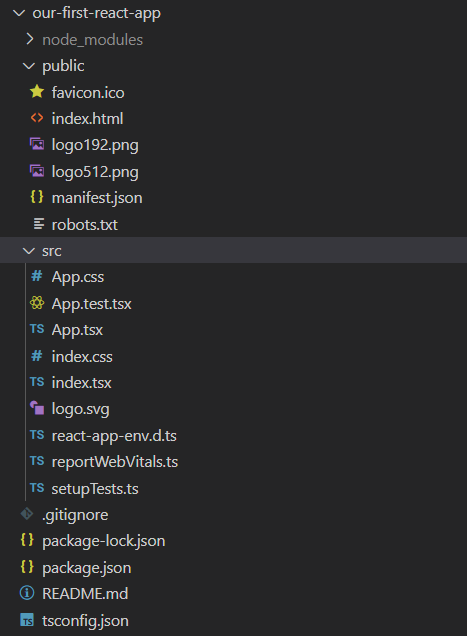
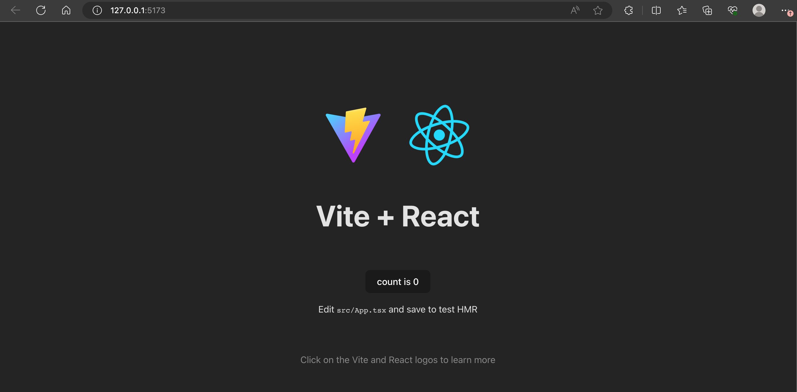

# React app aanmaken

## Vite

Er zijn verschillende manieren om een react applicatie aan te maken. Je kan gebruik maken van een volledig react framework zoals next.js of gatsby.js. Deze frameworks zijn heel krachtig en bieden veel functionaliteit aan. Maar soms is het ook handig om een eenvoudige react applicatie aan te maken zonder al te veel configuratie. 

In deze cursus gaan we gebruik maken van `vite` om onze eerste react applicatie aan te maken. Vite is een van de snelste build tools voor het aanmaken van een react applicatie. Het is ook heel eenvoudig in gebruik en bevat een development server die automatisch je applicatie herlaadt wanneer je een wijziging maakt aan je code.

## Een react applicatie aanmaken

Om een react applicatie aan te maken met `vite` moeten we enkel het volgende commando uitvoeren:

```bash
npm create vite@latest
```

Je zal hier dan een aantal vragen krijgen over de configuratie van je project. Zorg dat je de volgende opties selecteert:

```bash
│
◇  Project name:
│  our-first-react-app
│
◇  Select a framework:
│  React
│
◇  Select a variant:
│  TypeScript + SWC
```

`Project name` kies je uiteraard zelf. De andere opties zorgen ervoor dat we een react applicatie aanmaken met typescript. SWC is een snelle JavaScript/TypeScript transpiler die gebruikt wordt door `vite`. 

Je kan ook het commando uitvoeren zonder de vragen te beantwoorden door de volgende opties mee te geven:

```bash
npm create vite@latest our-first-react-app -- --template react-ts
```

Let op het extra `--` teken. Dit zorgt ervoor dat de opties niet door `npm` worden geïnterpreteerd, maar door `vite`. Zonder ga je toch nog de interactieve modus te zien krijgen.

We kunnen nu de folder `our-first-react-app` openen in Visual Studio Code en naar de inhoud van het project kijken:



Hier merk je onder andere volgende bestanden en folders in op:

* **node\_modules** deze folder bevat alle packages die werden geïnstalleerd bij het runnen van het `vite` commando. Alle packages die je zelf installeert met `npm install` zullen ook in deze folder terecht komen. **Normaal doe je nooit rechtstreeks aanpassingen in deze folder.**
* **package.json** beschrijft welke packages geïnstalleerd moeten zijn om deze applicatie uit te voeren. We noemen dit ook de **dependencies** van de applicatie. Het `npm install` commando zal deze dependencies dan installeren in de `node_modules` folder.
* **src** bevat de eigenlijke bestanden die rechtstreeks te maken hebben met react. Hier zal jouw broncode in komen. Het belangrijkste bestand op dit moment is het `App.tsx` bestand. Daar zullen we eerst onze eerste React code schrijven. Later zullen we dit opsplitsen in verschillende bestanden om het overzicht te bewaren.
* **public** bevat het HTML-bestand waarin de react applicatie zal getoond worden. Hier moet je meestal niets voor aanpassen want alle visuele componenten worden in react zelf gerenderd. Deze folder bevat ook andere dingen zoals het icoontje dat je in het tabblad van je browser ziet.

Je kan de applicatie opstarten door `npm run dev` uit te voeren in je terminal venster. Als alles in orde is zal je browser automatisch openen op de eerste en enige pagina van jouw webapplicatie:



:::info
Als je problemen hebt met het bereiken van de applicatie vanuit een devcontainer kan je de `package.json` aanpassen. Voeg de volgende regel aanpassen in de `scripts` sectie:

```json
"dev": "vite --host",
```
:::


### Je eerste component

Alle React applicaties zijn gebouwd uit verschillende React **componenten**. Componenten stellen afgebakende stukjes van de applicatie voor. Ze worden in moderne React code uitgedrukt als functies. Ze accepteren invoerwaarden (deze noemen we “props”) en geven een beschrijving terug van wat er in de gegenereerde pagina zou moeten staan. Met componenten splits je de UI in onafhankelijke, herbruikbare delen.

Het eerste component waar je altijd mee in aanraking zal komen kan je vinden in het `src/App.tsx` bestand. Deze zal er een beetje zoals het onderstaand bestand uitzien:

```typescript
import { useState } from 'react'
import reactLogo from './assets/react.svg'
import viteLogo from '/vite.svg'
import './App.css'

function App() {
  const [count, setCount] = useState(0)

  return (
    <>
      <div>
        <a href="https://vite.dev" target="_blank">
          
        </a>
        <a href="https://react.dev" target="_blank">
          
        </a>
      </div>
      <h1>Vite + React</h1>
      <div className="card">
        <button onClick={() => setCount((count) => count + 1)}>
          count is {count}
        </button>
        <p>
          Edit <code>src/App.tsx</code> and save to test HMR
        </p>
      </div>
      <p className="read-the-docs">
        Click on the Vite and React logos to learn more
      </p>
    </>
  )
}

export default App
```

:::info
Je bestand heet `App`**`.tsx`**, niet `App.ts`. Het bevat geen alledaagse TypeScript code. Het maakt ook gebruik van de TSX-syntax, die verderop wordt uitgelegd. Als je de extensie verkeerd invult, zal je een foutmelding krijgen.
:::

We zullen nu even het component herleiden tot de essentie door wat overbodige boilerplate code weg te halen. Zo bekomen we tot een heel eenvoudige `Hello world` applicatie:

```typescript codesandbox={"template": "react-starter", "filename": "src/App.tsx"}
import React from "react";

const App = () => {
  return (
    <div>
      <h1>Hello World</h1>
    </div>
  );
};

export default App;
```

We zien hier een aantal dingen:

* We zien hier eigenlijk gewoon een eenvoudige functie. We noemen deze in React geen functie maar een **function component**. Op deze manier maken we het onderscheid duidelijk met functies die werk verrichten dat niet rechstreeks zichtbaar is.
* Deze function component heeft geen parameters, maar in verdere delen zullen we zien dat we ook parameters kunnen meegeven aan componenten. Parameters van een component heten **props**.
* Deze functie returnt een waarde die genoteerd is in een HTML-achtige syntax. Deze HTML-achtige syntax heet **TSX**. Ook al ziet dit er grotendeels uit als HTML, is het eigenlijk TypeScript.
  * Om TSX over meerdere regels te kunnen spreiden zonder last te hebben van automatische puntkomma's, zetten we de hele TSX-expressie tussen ronde haakjes.
  * Af en toe zijn er lichte verschillen met echte HTML. Je ziet dit bijvoorbeeld aan het gebruik van `className`. In echte HTML is dit `class`.

:::info
Wanneer React gebruikt wordt met JavaScript, spreekt men over JSX in plaats van TSX.
:::

Omdat de component een functie is, kunnen we in de body van de functie alles doen wat onder normale omstandigheden kan in TypeScript functies. We kunnen bijvoorbeeld, voor we de `return` uitvoeren, variabelen initialiseren en berekeningen uitvoeren:

```typescript codesandbox={"template": "react-starter", "filename": "src/App.tsx"}
import React from 'react';

const App = () => {
  // we bevinden ons in de body van een TypeScript functie
  // we kunnen dus variabelen aanmaken zoals anders
  const title = "World";
  return (
    <div>
      <h1>Hello World</h1>
    </div>
  );
}

export default App;
```