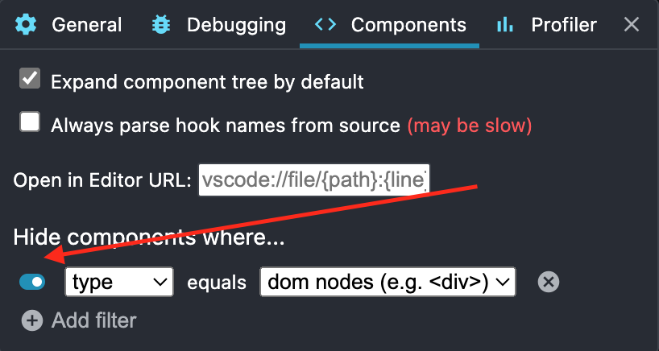

# React Developer Tools

React Developer Tools is een browser extensie die je kan installeren in Chrome of Firefox. Deze tool geeft je de mogelijkheid om de componenten van je React applicatie te inspecteren. Je kan de componenten bekijken, de props en de state van de componenten. Je kan ook de componenten aanpassen en de wijzigingen worden onmiddellijk doorgevoerd in de browser.

## Installatie

Afhankelijk van de browser die je gebruikt kan je de extensie installeren via de volgende links:

- [Chrome](https://chrome.google.com/webstore/detail/react-developer-tools/fmkadmapgofadopljbjfkapdkoienihi)
- [Firefox](https://addons.mozilla.org/en-US/firefox/addon/react-devtools/)

## Gebruik

Als je nu naar de browser gaat en je opent de developer tools, dan zie je een extra tabblad "Components" en "Profiler". In het tabblad "Components" kan je de componenten van je applicatie inspecteren. In het tabblad "Profiler" kan je de performance van je applicatie analyseren.

## Componenten inspecteren

Als je op het tabblad "Components" klikt, dan zie je een boomstructuur van alle componenten in je applicatie. Je kan de componenten openklappen en de props en state van de componenten bekijken. Je kan ook de props en state aanpassen en de wijzigingen worden onmiddellijk doorgevoerd in de browser.

## Inspecteren van niet React elementen

Soms is het handig om ook niet React elementen te kunnen inspecteren. Als je bijvoorbeeld wil nakijken welke key een bepaald element heeft gekregen bij het gebruik van een map functie. Daarom is er een optie voorzien in de settings van de extensie. Als je op het settings icoontje klikt in de extensie, dan kan je de optie "Hide components where..." afzetten. Als je nu terug naar de browser gaat en je opent de developer tools, dan zie je dat je nu ook niet React elementen kan inspecteren.

Het is wel aangeraden toch deze vlak terug af te zetten als je klaar bent met het inspecteren van niet React elementen. Anders wordt het snel zeer onoverzichtelijk.