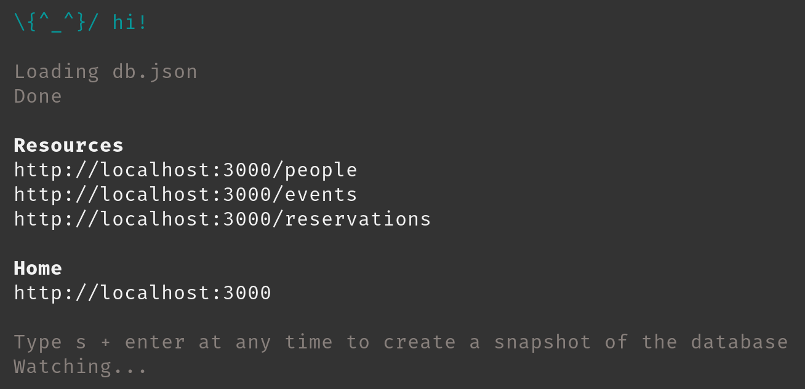
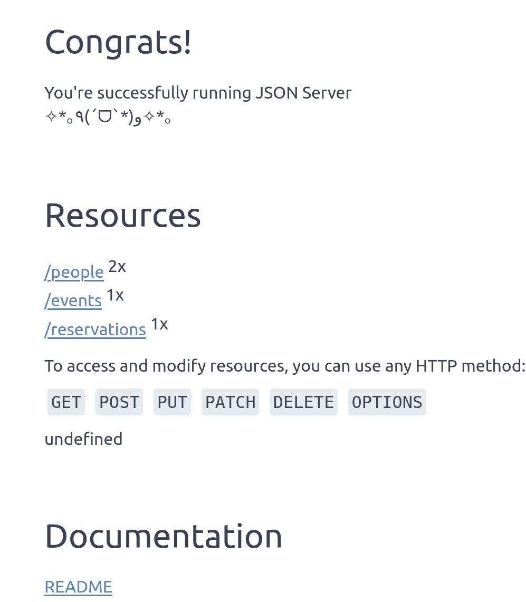
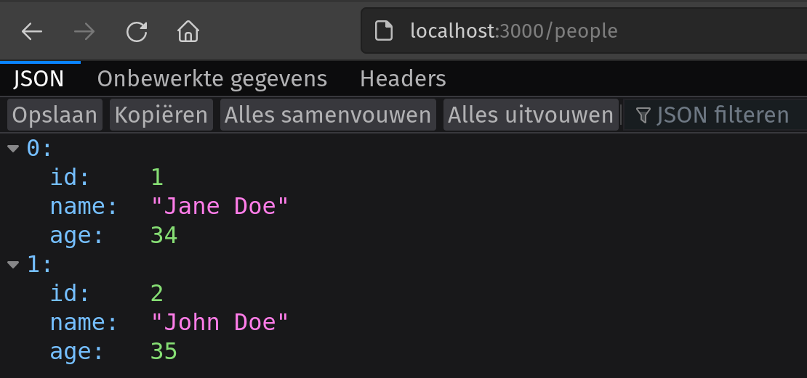
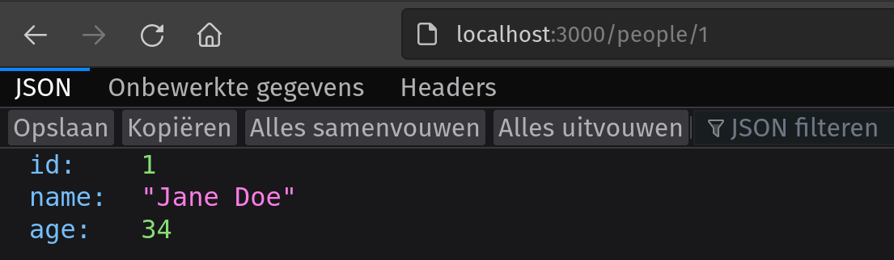

# JSON Server

We gaan in deze cursus vaak moeten gebruik maken van een JSON API. Omdat deze over het algemeen fictieve data bevat of de echte API gelimiteerd is (maximaal aantal API calls,...) gaan we meestal gebruik maken van `json-server` die het mogelijk maakt een json bestand te gebruiken als API.

## Opzetten

Eerst heb je een JSON-bestand nodig met daarin de data die wordt aangeboden door de API. Plak hiervoor volgende gegevens in een bestand, dat je db.json noemt:

```
{
  "people": [
    {"id": 1, "name": "Jane Doe", "age": 34},
    {"id": 2, "name": "John Doe", "age": 35}
  ],
  "events": [
    {"id": 1, "title": "verjaardagsfeestje", "date": "2022-07-01"}
  ],
  "reservations": [
    {"id": 1, "location": "springkasteel", "date": "2022-07-01"}
  ]
}
```

Start ten slotte de JSON server op: open via de terminal de locatie waar het opgeslagen bestand staat en voer het volgende commando uit: 

```
npx json-server --watch db.json. 
```

- npx zorgt ervoor dat je bepaalde tools niet globaal moet installeren op je machine en dat je altijd de laatste nieuwe versie hebt.
- `json-server`, zegt gewoon dat je de json-server tool wil gebruiken.
- Via --watch geef je aan dat het programma wijzigingen aan het bestand moet opmerken. 
- Het laatste deel, db.json, is de naam van het bestand met daarin je gegevens. Het is dus ook toegelaten een andere naam dan db.json te gebruiken, op voorwaarde dat je dat consequent doet.

:::note
JSON server start op poort 3000. Als deze al in gebruik is, kan je een andere poort gebruiken door --port mee te geven, gevolgd door een ander poortnummer, bijvoorbeeld 3001.
:::

Je zou nu een bericht zoals het volgende moeten zien:



## Gebruik

Surf naar de URL die in de screenshot aangegeven is onder "Home". Je zou ongeveer het volgende scherm moeten zien:



Dit betekent dat je gebruik kan maken van HTTP requests (en dus van fetch) om gegevens over personen, evenementen of reservaties aan te maken, op te vragen, te wijzigen of te wissen (CRUD).

Dit is het makkelijkst te demonstreren via een HTTP GET-request, omdat dat vanzelf verstuurd wordt wanneer we in de browser naar een bepaalde URL navigeren. Als we bijvoorbeeld naar localhost:3000/people surfen, sturen we een GET-request naar deze URL. Het antwoord is dan een array in JSON-formaat. In de browser ziet dit er ongeveer zo uit (maar de weergave kan anders zijn naargelang je browserversie):



Het is ook mogelijk gegevens over een specifieke persoon op te vragen door de ID mee te geven als onderdeel van de URL. De URL voor persoon 1 wordt dan: localhost:3000/people/1:



## Custom ID velden

JSON server veronderstelt dat elk opgeslagen object beschikt over een ID. Als je data probeert op te slaan die niet over een property id beschikken, voegt JSON server zelf een property id toe met een automatisch gegenereerde waarde.

Dit is niet altijd wat je wil. Als je zelf ID's genereert, moet je opstarten met de extra optie --id gevolgd door de naam van de property die je wil gebruiken. Bijvoorbeeld: `json-server --watch --id uuid db.json`.